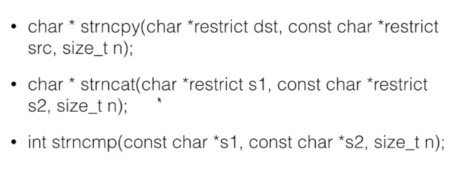
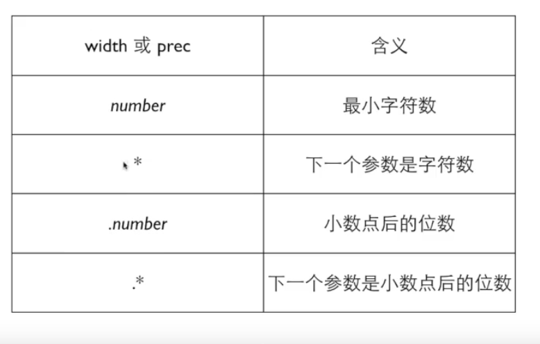

# C Learning

Created: 2021-08-05 15:17:10 +0800

Modified: 2021-09-30 14:17:20 +0800

---


二分法

{width="3.6333333333333333in" height="1.3916666666666666in"}

初始化 使用变量前先赋值一次

表达式 =

变量类型 不可改变

常量 值与类型都不可变

&:取地址符 使用scanf时 变量前要加上

整数四则运算（如/除）仍然是整数 会去掉小数部位 不会四舍五入（地板除）


运算符 算子

单目运算 取正取负 如：a*-b

先-b再*a

a=b=6 -> a=(b=6)


c没有幂次方 指数较小可以copypaste 多了就要用循环语句力

Printf("%",&) f:format

Scanf()

Int %d

float %f %.Xf

Double %lf

Const int a = ...

Fabs() 绝对值


交换变量

程序按步骤进行

中间量


断点 运行时停下来 此时可以通过分析界面看到变量值


复合赋值 四则运算与=结合：复合赋值运算符

total += a

total = total + a


total *= a+3

total = total * (a+3)


++ -- 递增递减运算符 作用就是给变量加减1

count++

count += 1

count = count + 1

**前缀后缀结果不同**

a++ 表达式输出的是以前的a 但这之后a已经加上1了

++a 表达式输出的是之后的a 此时a就是加上1后的a


16进制 %x 直接将输入的十进制整数换算为16进制数


关系运算 结果是整数1（True）或0（False）

优先级比四则运算低 比赋值高

如int r = a>0; 如果a>0,则r=1

==/!= 比 >< 低

从左往右运算 如6>5>4 ->0


// 注释哟

/* */ 多行注释

ctrl + / 快速注释

else 不带大括号时 默认属于最近的if语句 保险起见加上大括号


if

else if

else


switch-case:

switch (控制表达式结果只能为整数) {

case 常量:

语句;

break;

case 常量:

语句;

break;

default:

语句

}


switch圆括号内整数只代表从哪个case开始执行 一直执行到break为止

while循环 循环体

do-while循环

先进循环 一次后再判断是否符合

do

{

<循环体语句>

} while (<判断语句>);


临界值

使用较小的值模拟运行程序 再代入较大的值


先保存最初的值


while里再放入scanf输入 这样可以多次输入

ret = ret * 10 + a 将原本的数左移一位 最后一位放入


For循环 计数循环 i达到某值前 "对于...当...时"

for (<初始动作>;<循环条件>;<循环动作>) {

<循环语句>

}


example:

for (int i=1;i<=n;i++) {

<...>

}


※求和初始0 求积初始1


注意循环条件与while相同 最开始检测

三个条件都可以省略 分号不能省


i=0;i<n /// i=1;i<=n 循环n次

前者最后i=n-1 后者最后i=n


※For == while

如果有固定次数，用for

如果必须执行一次，用do_while

其他情况用while


t 是


除号两边有一个是浮点数 结果就是浮点数 如 sum += 1.0 / n


循环控制

1.  定义一个变量 类似于布尔值 缺点：浪费循环次数

2.  使用break,continue语句

break 跳**出当前**循环 不进行下一轮

continue 跳**过**循环后面的语句 进行下一轮循环

接力 break

3.  goto <flag>; flag**:** 只在想要跳出多重循环时使用 不要滥用

次幂一定注意是乘自己n-1次


C语言是有类型的语言

整数：char int short long、long long

浮点数：float double、long double

逻辑： bool

指针

自定义类型


格式化名称不同

表达形式：补码 编码


sizeof() 给出类型或变量的长度 单位：字节

sizeof是静态的 表达式


整数

char 1字节 8比特

short 2字节

int 取决于编译器/cpu

int就是来表达寄存器的


long 取决于编译器/cpu

long long 8字节


负数

1.  flag 标志 表示它是负数

2.  取中间的数为0 如1000 0000为0

```{=html}
<!-- -->
```
3.  **补码**

1111 1111 纯二进制255 补码-1

补码 + 原码 = 溢出的零

如 1111 1111 + 0000 0001 = （1） 0000 0000

数的范围：char 一个字节：

0000 0000 --> 0

1111 1111 ~ 1000 0000 --> -1 ~ -128

0000 0001 ~ 0111 1111 --> 1 ~ 127

**-128 ~ 127 包括0 总共256个**


int 4/8个字节

00000000 00000000 00000000 00000000

**-2^32-1 ~ 2^32-1**


unsigned 不看作补码形式

unsigned char : 0-255


{width="3.408333333333333in" height="2.325in"}{width="0.35in" height="0.45in"}{width="2.325in" height="2.325in"}{width="2.325in" height="2.325in"}{width="0.15833333333333333in" height="0.2833333333333333in"}{width="0.2in" height="0.3416666666666667in"}{width="0.20833333333333334in" height="0.24166666666666667in"}{width="0.175in" height="0.24166666666666667in"}{width="0.19166666666666668in" height="0.13333333333333333in"}{width="1.7in" height="1.7in"}{width="1.7in" height="1.7in"}{width="0.6666666666666666in" height="0.2916666666666667in"}{width="0.6666666666666666in" height="0.2916666666666667in"}{width="0.2833333333333333in" height="0.15833333333333333in"}{width="0.2833333333333333in" height="0.15833333333333333in"}{width="0.15in" height="0.20833333333333334in"}{width="0.15in" height="0.20833333333333334in"}{width="0.2in" height="0.225in"}{width="0.6166666666666667in" height="0.21666666666666667in"}{width="0.2in" height="0.225in"}{width="0.20833333333333334in" height="0.13333333333333333in"}{width="0.6166666666666667in" height="0.21666666666666667in"}{width="0.20833333333333334in" height="0.13333333333333333in"}{width="0.15in" height="0.44166666666666665in"}{width="0.15in" height="0.44166666666666665in"}{width="0.13333333333333333in" height="0.38333333333333336in"}{width="0.21666666666666667in" height="0.30833333333333335in"}{width="0.13333333333333333in" height="0.38333333333333336in"}{width="0.24166666666666667in" height="0.2833333333333333in"}{width="0.225in" height="0.25833333333333336in"}{width="0.225in" height="0.3in"}{width="0.25in" height="0.175in"}{width="0.20833333333333334in" height="0.15in"}


8进制 0开头 **%o**

16进制 0x开头 **%x**

只是我们自己怎么看 内存中永远是二进制

无特殊需要 就用 int 或者 float

{width="1.55in" height="0.525in"}

**浮点数**

float 32bit 7位[有效数字]{.underline}

scanf("%f") printf("%f %e")

double 64bit 15位

scanf("%lf") printf("%f %e")


多位小数%.5f **四舍五入**

{width="1.7083333333333333in" height="0.9916666666666667in"}

能准确输出的位数


比如double a = 0.0049;

printf("%.30f",a);

-->0.004899999999999999841793218991


离散的数 浮点数就是不准确

科学计数法

-5.67E+12

6.54E-4


混合输入


%d %d

%d%d

浮点数可以表示无穷大

两个浮点数f1 == f2 可能失败

1.345 是 double

1.345f 是 float


浮点数 1bit符号 11bit指数 52bit数值

专用浮点计算


没有特殊需要 double

{width="4.091666666666667in" height="3.408333333333333in"}

字符类型

char是整数 也是字符

'a','1' 字符1

char d = '1'

%d,d --> 49

%c 输入输出

ASCII码 以整数代表字符


字符计算 ascii计算

两个字符相减得到整数为距离

一个字符加一个数字得到下一个字符 ++a


大小写转换：

a + ('a' - 'A')

b Backspace

t 制表符 table


类型转换

当运算符两边出现不一致的类型时 会自动转换成较大的类型

{width="4.9in" height="0.8in"}


强制转换：
(类型)值 例如： (int)10.2 (short)

(short)32768 = -32768 因为short最大是32767 所以会导致溢出

(char)32768 = 0

32768 = 10000000 00000000 只取后8bits

**不改变原变量的类型与值**


布尔值

c语言最初没有bool 只有0 1


#include <stdbool.h>

就可以使用 bool

True False 但是不会输出true false


{width="4.366666666666666in" height="3.4in"}

逻辑运算

| !    | 逻辑非 | 最高 |
|------|--------|------|
| &&   | 逻辑与 | 中间 |
| || | 逻辑或 | 最低 |


4<x<6 不对

x>4 && x<4


判断是否大写：

c >= 'A' && c <= 'Z'


{width="4.166666666666667in" height="1.3in"}

条件运算符

<1> ? <2> : <3>

1.  条件

2.  条件满足后的值

3.  条件不满足后的值

逗号也是一种运算符

(3+4,5+6) 逗号表达式结果是 11


for ( i=0 , j=11 ; i<j ; i++, j--) {}


函数 一块代码

返回一个值或者零个值


<函数头> {

<函数体>

}


void 函数不返回值

int 返回整数


调用： 函数名(参数);

没有参数也要()


return 停止函数的执行

return;

return 表达式;


单一出口


函数先后关系


函数原型（声明）：

将函数头放在开头

函数体可以放在后面（也要加函数头）


传给函数的只能是值

每个函数有自己的变量空间


[函数头里的叫形参]{.underline}

[给函数的叫实参]{.underline}


定义在函数里的变量叫本地变量

参数也是


{width="3.35in" height="1.2833333333333334in"}

变量可以在块内

也可以在语句内 但是在语句外就消失了

里面的块定义同名

{width="4.416666666666667in" height="2.591666666666667in"}


**数组**

int number[100]; //定义数组 单元是int

number数组可放100个int

number[cnt] = x; //对数组中第cnt位进行赋值

number[i] ...

元素数量是整数

数组从0开始 下标/索引


数组越界 最大是

segmentation fault


**注意数组初始化**

**遍历数组输出**


a[] = {1,2,5,33,6,2,9} 数组大小为7

a[7] = {2} --> 2,0,0,0,0,0,0 除了第0索引其他都为0

初始化：a[<数量>] = {0};


**定位赋值**

![int a [ 10 ] = Y; C99 0 = 3 ， 6 · 用 [ n ] 在 初 始 化 数 据 中 给 出 定 位 · 没 有 定 位 的 数 据 接 在 前 面 的 位 置 后 面 · 其 他 位 置 的 值 补 零 · 也 可 以 不 给 出 数 组 大 小 ， 让 编 译 器 算 · 特 别 适 合 初 始 数 据 稀 疏 的 数 组 ](../media/学习笔记-C-Learning-image43.png){width="4.208333333333333in" height="3.225in"}

↑{2,0,0,3,6,0,0,0,0,0}


数组大小：

sizeof 求数组占用的字节

sizeof(a) / sizeof(a[0]) 可以求出数组大小


数组不能整个赋值给另外一个数组 只能遍历

**int b[] = a;**


遍历数组

通常使用for循环 i从0到<数组长度


数组作为函数参数时，往往必须再用另一个参数来传入数组的大小


调试技巧：使用大括号 里面的变量就是局部的了


二维数组

int a[3][5]

三行五列的矩阵

{width="3.566666666666667in" height="2.175in"}

二维数组遍历需要两次循环

a[i,j] == a[j]


行可以省略 列不可以省略

![int at] [ 5 ] { ‰ 1 ， 乙 3 ， 4}, { 荔 3 ， ‰ 5 ， 6 } " ． 列 数 是 必 须 给 出 的 ， 行 数 可 以 由 编 译 器 来 数 · 每 行 一 个 { } ， 逗 号 分 隔 · 最 后 的 逗 号 可 以 存 在 ， 有 古 老 的 传 统 · 如 果 省 略 ， 表 示 补 零 · 也 可 以 用 定 位 （ *C990NLY) ](../media/学习笔记-C-Learning-image45.png){width="3.308333333333333in" height="2.4in"}


取地址运算

& 获得变量的地址 必须对变量取地址

取地址符右边必须是明确的变量

%x十六进制

%p指针 地址 以十六进制


堆栈 分配内存自高向低


数组 0 1 2 3 4 ······

低 高


指针变量 保存地址的变量

int *p = &i; 将i的地址交给指针p p指向i

int *p 定义一个指针变量p

*p *q *是给变量的 不是给int的


可以在函数内访问其他变量


*单目运算符 *p可以作左值也能做右值


*p作为整体相当于整数

如果事先定义了p为指针 那p用%p输出的就是地址


*p = 26 改变了i的值 i=26


{width="3.6333333333333333in" height="1.6916666666666667in"}

出现在赋值号左边的是值 可以接收右值


指针应用场景：

函数需要返回多个值


函数运行状态通过return返回

实际计算结果通过指针返回


指针没有得到地址之前 不能对其赋值 访问


数组传进函数中 sizeof大小就变了

因为数组传进函数就是以指针形式传入的

函数参数表里的数组是指针

有a[] = {}则：

int a[] int *a 两者相同

sizeof(a) == sizeof(int *)2


数组变量本身表达的就是地址

但是对单个单元需要用&取地址

a == &a[0] 首地址

p[0] <==> a[0]


把数组变量当作指针用也可以

相当于 int a[] == int *const a;

**指针是CONST**

{width="3.908333333333333in" height="1.8416666666666666in"}


Const在 * 的前面 --》 指针所指的不能被修改

后面 --》 指针不能被修改

{width="3.4583333333333335in" height="2.4583333333333335in"}![const 数 组 · const int al] = {I ， 2 ， 3 ， 4 ， 5 ， 6 ， } ； 数 组 变 量 已 经 是 c 。 nst 的 指 针 了 ， 这 里 的 const 表 明 数 组 的 每 个 单 元 都 是 （ 。 nst int · 所 以 必 须 通 过 初 始 化 进 行 赋 值 ](../media/学习笔记-C-Learning-image49.png){width="3.2083333333333335in" height="2.2916666666666665in"}![· 因 为 把 数 组 传 入 函 数 时 传 递 的 是 地 址 ， 所 以 那 个 函 数 内 部 可 以 修 改 数 组 的 值 · 为 了 保 护 数 组 不 被 函 数 破 坏 ， 可 以 设 置 参 数 为 const · int sum(const int al], int length); ](../media/学习笔记-C-Learning-image50.png){width="3.775in" height="1.4583333333333333in"}

指针+1 ： 下一个单元 即移动sizeof(类型)个字节

*p --> ac[0]

*(p+1) --> ac[1]

*(p+n) --> ac[n]

+ 后移 - 前移 p++ p--

p-q 指针相减 得到地址间有几个单元 (sizeof )

如果指针不是指向一片连续分配的空间,如数组，则这种运算没有意义


*p++ 先取出p指向的数据 然后将p指向下一个数据

连续空间操作 如遍历


指针可以比较 --> 地址大小比较

{width="3.6in" height="2.8333333333333335in"}


{width="3.325in" height="2.2in"}


{width="3.566666666666667in" height="2.675in"}{width="6.041666666666667in" height="2.7333333333333334in"}

动态内存分配 **C99之前**不能用变量指定数组长度

malloc(字节大小)

#include <stdlib.h>;

返回的是void* 还要用(int*)转换一下

a = (int*)malloc(n*sizeof(int));

之后就是当作数组来用

最后还要清除空间 free()


申请失败则返回 0 或者 NULL

{width="4.041666666666667in" height="0.4083333333333333in"}

地址改变过就不能free了


养成习惯 malloc配上free


字符串


字符串**常量**

char *s = "Hello World";


代码段 只读 不可改写

{width="4.633333333333334in" height="1.8in"}

如果需要修改字符串 可使用数组：

char s[] = "Hello World!";

"Hello World!" 被复制到s[]里 此时可写


![指 针 还 是 数 组 9 · char *str = "Hello ， · char word[] = "Hello' ． 数 组 ： 这 个 字 符 串 在 这 里 ． 作 为 本 地 变 量 空 间 自 动 被 回 收 ． 指 针 ： 这 个 字 符 串 不 知 道 在 哪 里 ． 处 理 参 数 ． 动 态 分 配 空 间 ](../media/学习笔记-C-Learning-image57.png){width="3.025in" height="2.7in"}


%s 读入一个单词 到空格tab回车为止

%7s 最多读入7个字符


**a 指针a指向一个指针 再指向一个地址

a[][10] 二维数组 每一个字符串最长为10

*a[] 指针数组 存放的全部都是指针 指向字符串


main(int argc , char const *argv[] ) 符号链接


putchar(int c) 返回int

向标准输出写一个字符

getchar(void) 返回int

从标准输出读入一个字符

EOF代表结束

Ctrl+Z 然后**回车** 即输入一个EOF


string.h


字符串函数

strlen 字符串长度


strcmp 比较字符串

0 ： s1 == s2

1 ：s1 > s2

-1 ：s1 < s2

比较得出的是 字符串不相等字符的差值

char s1[] = "abc";

char s2[] = "bbc";

printf("%d",strcmp(s1,s2));

--> -1 因为'a' - 'b' == -1


将字符串当作数组||当作指针遍历


strcpy()


char * strcpy(char *restrict dst, const char *restrict src)

返回的是dst这个字符串数组 dst是变量 src是字符串常量

restrict 不重叠

**将第二个字符串拷贝到第一个字符串**

复制一个字符串

char *dst = (char*)malloc(strlen(src)**+1**)

先申请一个内存空间

然后再strcpy(dst,src)


strcat()

char * strcat(char *restrict s1, const char *restricts2);

将s2拷贝到s1后面形成新的字符串

返回s1

s1要有足够的空间

s2的第一个字符会把s1最后的0覆盖

即dst[strlen(dst++)] = src[i++];


安全问题strcpy strcat

没有足够空间

安全版本 strncpy strncpy strncmp 参数里加一个整数

{width="4.333333333333333in" height="1.6166666666666667in"}

strncmp 用处 只判断前n个字符


strchr(字符串,字符)

返回指针

strstr(字符串,字符串)

strcasestr()


常量符号化


枚举 用户定义的数据类型

enum NAME {NAME1,NAME2,NAME......};

类型名字不一定要有

name的类型是int 由0到n

给常量名字


可以当作数据类型使用

enum color t = red;


套路：枚举可以自动计数

enum COLOR {RED,YELLOW,GREEN,NumCOLORS};


枚举量可以指定值


{width="3.35in" height="2.2083333333333335in"}


结构类型 structure

struct structName {

int a;

int b;

int c;

////

}; <--分号要有


{width="4.616666666666666in" height="1.5in"}

要用的时候类似于int x; char ch;这样

struct structName variantName;

或者直接：

{width="2.1in" height="2.1666666666666665in"}


{width="4.566666666666666in" height="2.2583333333333333in"}


{width="4.391666666666667in" height="1.1in"}


没有直接的方式一次输入一个结构

函数得到的只能是值 结构变量里的值


1.  建立一个临时的结构变量 返回结构

struct Name Func(void) {

struct Name p;

...

return p;

}

x = Func();

x == p


2.  传递指针 性能更好

{width="3.066666666666667in" height="1.8833333333333333in"}

->


结构数组

Name[2] = {{a,b,c},{x,y,z}};

Name[i].first = ...


结构中也可以有结构


![· C 语 言 提 供 了 一 个 叫 做 pedef 的 功 能 来 声 明 一 个 已 有 的 数 据 类 型 的 新 名 字 。 比 如 ， typedef int Length; 使 得 Length 成 为 int 类 型 的 别 名 。 这 样 ， Length 这 个 名 字 就 可 以 代 替 int 出 现 在 变 量 定 义 和 参 数 声 明 的 地 方 了 ， Length a, b,len ， Length •numbers 卩 0] ， ](../media/学习笔记-C-Learning-image65.png){width="5.75in" height="2.691666666666667in"}{width="5.791666666666667in" height="4.291666666666667in"}


联合 跟sturct很像 但是里面的元素共用一个内存空间


x86 小端 Little Endian 低位在前


本地变量


全局变量 定义在函数外面

具有全局的生存期和作用域

所有函数都可以使用全局变量

任何函数里都可以更改全局变量


没有初始化的活会得到 0 值

指针的话是NULL值

初始化必须是确定值（常量）


函数里有个同名的变量 全局变量会被隐藏


__func__ 当前函数名的字符串


静态本地变量： static xxx xxx = xxx;

第一次进入时定义变量 退出函数时保留变量值

静态本地变量其实就是全局变量 在内存里是紧挨着的

作用域只在函数中


返回指针的函数

1.  返回本地变量有危险 不受控 但是还存在

2.  返回全局变量或静态本地变量是安全的

3.  最好的是返回指针

不要使用全局变量来传递参数和结果

函数可重入/不可重入


编译预处理指令

#开头

#define 定义一个宏


#define PI 3.14159

其实就是**文本替换**

#define format "%d"


{width="4.425in" height="3.2083333333333335in"}

宏里有其他宏的名字 又会进行一次替换


{width="3.4833333333333334in" height="3.025in"}


带参数的宏

#define cube(x) ((x)*(x)*(x))

{width="4.125in" height="2.8in"}


{width="3.8333333333333335in" height="2.325in"}

头文件

#include

把文件所有内容插入那一行

{width="5.325in" height="3.8666666666666667in"}


{width="5.4in" height="3.6416666666666666in"}


{width="5.8in" height="1.55in"}


{width="5.775in" height="3.55in"}


Clion 调试模式下不能用printf输出

在printf语句前加上 setbuf(stdout, 0);


**extern** int xxx; 注意不能初始化

在头文件中声明全局变量xxx

{width="2.975in" height="0.8833333333333333in"}


{width="3.2in" height="4.116666666666666in"}


条件编译

避免头文件重复引用

标准头文件结构:

#ifndef __LIST_HEAD__

#define __LIST_HEAD__


#include "name.h"


#endif

{width="4.666666666666667in" height="1.4333333333333333in"}


{width="6.225in" height="4.0in"}{width="5.775in" height="3.675in"}{width="5.116666666666666in" height="4.541666666666667in"}{width="6.683333333333334in" height="4.1in"}

%n 输出到这里时有多少个字符 后面可以跟&变量名 填充到变量里面


![flag hh scanf: char short %[flag]type flag Il long, double long long long double ](../media/学习笔记-C-Learning-image82.png){width="6.108333333333333in" height="4.466666666666667in"}![scanf. 用 于 int %[flag]type type d 0 C 整 数 ， 可 能 为 十 六 进 制 或 八 进 制 unsigned int 丿 进 制 十 六 进 制 float Char type S P 用 于 字 符 串 （ 单 词 ） 所 允 许 的 字 符 指 针 ](../media/学习笔记-C-Learning-image83.png){width="5.966666666666667in" height="4.125in"}


{width="6.341666666666667in" height="4.075in"}


{width="7.091666666666667in" height="3.775in"}


{width="6.591666666666667in" height="4.825in"}

位运算 to be learned


可变数组

1.  可增大

2.  可获取大小

3.  可访问

自定义一个函数


{width="4.366666666666666in" height="2.225in"}


{width="1.8in" height="0.9083333333333333in"}

struct array not *array

最好不要定义出一个指针类型


链表

数据+指针------节点Node

{width="2.5833333333333335in" height="1.375in"}

可变数组的替代


用一个list来代表链表 方便日后对list中的指针做修改

链表函数


链表搜索 遍历

{width="3.6in" height="0.24166666666666667in"}

非常常见的写法 p=p->next


当用到->时 指针不能为NULL

边界条件

要有足够的代码保证指针安全


qsort函数

void qsort(void *arr, size_t n, size_t size, int (*cmp)(const void *, const void *))

arr表示要排序的序列，可以是数组名或指针

n表示arr中有多少待排序的元素

size表示arr中单个元素的大小（如果是动态分配内存的序列要注意）

cmp表示自定义的比较函数（核心！！！）


cmp的框架


int cmp(const void *a, const void *b) {

return;

}


升序

int cmp(const void *a, const void *b) {

return *(int*)a - *(int*)b; /* a、b分别指向arr1/arr2中某个元素 */

}


