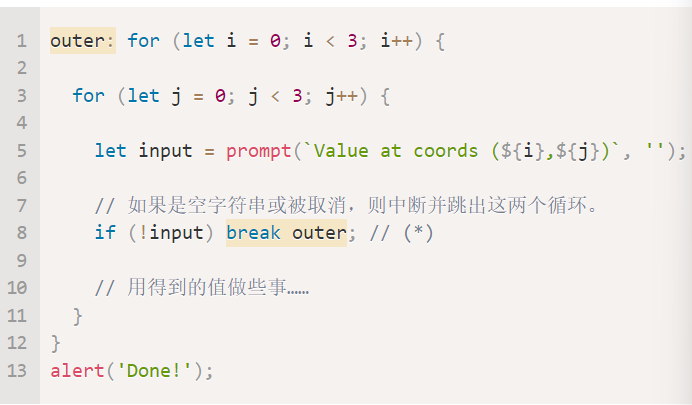
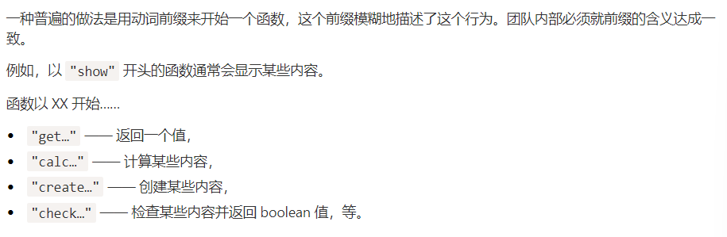
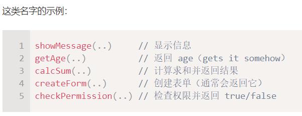
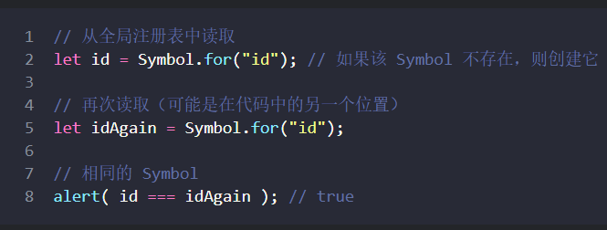

# Javascript-Basic

## 变量

`let <name>;` 声明变量 变量名只允许 **数字/字母/$/_**

`const <name>`常量  

变量命名规则（单驼峰法）：

首字母小写 新单词首字母大写

Example: `userName` `playerHealth`

### 动态变量类型

1. 数字类型：包括Infinity -Infinity NaN 特殊数值

2. BigInt类型：整数结尾加上n

3. string类型：

   双引号单引号都一样

   反引号``允许 ${…} 引用变量/表达式

4. 布尔类型

5. null值：就是空值

6. undefined值：未被赋值

7. object：对象

8. symbol：唯一性符号 

`typeof x` / `typeof(x)` 返回类型字符串

## 基础函数

### 浏览器提示

`alert()`

`prompt(title,[default])`

```javascript
let input=prompt('Your Name:',['Jane Doe']); // 点击取消返回null值
```

`confirm(question)` 返回布尔值

### 类型转换

`String()` `Number()` `Boolean()`

## 运算符

求幂 `a**b --> a^b`

次方根 `a**(b/c)`

### 字符串运算符

`'4' + 1 --> "41"` 只要其中有一个字符串 结果就是字符串

只有+可以连接 其他运算符都会把字符串转换为数字再处理

`'6' / '2' --> 3`

数字字符串前面加上+号转换为数字

`+'2' + +'6' --> 8`

`'2' + '6' --> "26"`

字符串比较 字典/词典 'Z'>'A' unicode顺序 先大写 后小写

### 二元运算符

`*= /= += -= %= **= ++ --` 

比较运算符跟c一样

### 不同类型间的比较

当对不同类型的值进行比较时，JavaScript 会首先将其转化为数字（number）再判定大小

`===` 严格相等符

### 逻辑运算符

条件判断跟c差不多 `result = expr ? A : B`

逻辑运算 `&&` `||` `!`  


逻辑运算链 :

`v1&&v2&&v3` 返回第一个假值 

`v1||v2||v3` 返回第一个真值  

空值合并运算符 `??`：

为可能是未定义的变量提供默认值

`alert(user ?? "i");`

还可以使用 ?? 序列从一系列的值中选择出第一个非 null/undefined 的值。

## 循环

循环与C类似  `for` `do ... while` `while`

特别的是循环标签

{width="5.758333333333334in" height="3.375in"}


`switch case` 基本一样 但是case后面可以跟字符串

## 函数

### 声明

```js
function showMessage() {
	alert('asdfasdfasdf');
}
```

### 参数

没有给参数的话默认为`undefined`

可以在声明中设置默认值（跟python有点像）

`function ass(size,round = true) {...}`

或者设置函数：

`function ass(size,round = getround()) {...}`

或者用 `??` or ` || `来设置参数为空值的时候的替代值

### 命名

{width="7.625in" height="2.4916666666666667in"}


{width="5.008333333333334in" height="1.9166666666666667in"}


`let result = ( args ) => expression` 动态创建一个函数（该函数不保留）

## 调试

chrome控制台

console.log() 控制台输出 多参数

## 代码质量

JSDoc 记录函数的语法

<http://en.wikipedia.org/wiki/JSDoc>

### Polyfill

添加可能缺少的特性

### Transpiler

现代语法与运算符转译为老旧引擎能看懂的

展示对各种特征的当前支持情况的工具：
-   <https://kangax.github.io/compat-table/es6/>------ 对于原生 JavaScript。
-   <https://caniuse.com/>------ 对于浏览器相关的函数。

## 对象

### 对象创建与访问

```js
let user = {
	name:"",
	age:20, //<-- 尾随逗号 方便一点
};
```

`user.isAdmin = true;` 直接添加属性

`delete user.age;` 删除属性  

带空格的key要用""包围

使用方括号`[]`来引用value （字符串）

`user["xx ii aa"] = true;`

点号后面是固定的属性，若想用变量访问value只能用`[]`

### 操作符 in

`"key" in obj` 返回true或false

#### 遍历对象属性

`for(key in object) {}`

```js
let user = {
    name: "john",
    age: 20,
    gender: "Male",
};

for ( key in user ) {
    console.log(`${key} = ${user[key]}`);
}
```

### 属性顺序

整数属性按照升序排列 而其他属性按添加顺序排列

"整数属性"指的是一个可以在不做任何更改的情况下与一个整数进行相互转换的字符串。

想要不被整数属性影响，可以在数字前加上+ 后面引用时变量前面加上+

### 克隆对象

将一个对象赋值给另一个对象，只是复制了一个类似指针的东西

对其中一个进行修改，另外一个也会改变

这两个对象是相等且严格相等的

而**都为空的对象或者只是属性相同的对象不相等**  


克隆一个对象：
- 遍历属性 拷贝到新对象中

- .assign方法 `Object.assign(dest, [src1, src2, src3...])`

  如果被拷贝的属性的属性名已经存在，那么它会被覆盖

  按照参数顺序拷贝，若src2有src1的属性，将会覆盖掉src1的属性

一行克隆:`let clone = Object.assign({},src);`

若对象里面嵌套对象，则需要使用递归，判断每个属性是否为对象，再完全复制

或者直接使用现有轮子（**深克隆**）  


无法获取对象的变量名称，因为一个对象可以有很多变量可以指向它

#### 垃圾回收

可达性：

如果没有全局变量能够访问到这个对象，该对象就会被删除

要与最原始的根（root）相连，才算可达

内部算法：mark-and-sweep

### 对象方法

```js
let user = {
    checkId() {
        ...
    }
}
```

### 对象 this

自我引用 用`this`

`this` 的值是在代码运行时计算出来的，它取决于代码上下文。

链式调用：

`ladder.up().down().down().up()`

每个函数最后return this;

#### 构造函数

```js
function Person(name) {
    this.name=name;
    this.isAdmin=false;
}

let john = new Person("john");
let alice = new Person("alice");
```

大写作为函数名  使用new来执行

对象方法构造示例

```js
function Accumulator(startingValue) {
    this.value=startingValue;
    this.read = *function*() {
        this.value+= +prompt("enter:");
    }
}
```

## 可选链 ?.

对undefined尝试读取.xxxx会抛出错误

用可选链`?.`规避错误

例如 `value?.prop`：

如果 value 存在，则结果与 value.prop 相同，

否则（当 value 为 undefined/null 时）则返回 undefined。

```js
let myself = {
    name : "I",
    gender : "Male",
    age : 19,
    address : {
        country : "China",
        province : "Fujian",
        city : "Fuzhou"
    }
}

console.log(myself.address?.country?.aaa?.aaa);
```

一定有的属性就不要加上?了

"短路效应" ?前面为null/undefined 后面就不会进行

#### 方法/键值对

`?.()`，`?.[]`

`userAdmin.admin?.();` 若admin是对象的方法即调用，否则返回undefined

`user1?.[key]` 类似

可以使用 ?. 来安全地读取或删除，但不能写入

## Symbol类型

根据规范，对象的属性键只能是字符串类型或者 Symbol 类型。不是 Number，也不是 Boolean，只有字符串或 Symbol 这两种类型。

`let id = Symbol("iiiddd");`

`""`里面是symbol描述 描述相等Symbol不会相等

Symbol不会被自动转换为字符串 (console.log()貌似可以)

用Symbol作为键更加安全 不会出现相同的字符串意外访问的情况

```js
let id = Symbol("id"); // 要先定义该Symbol

let user = {
    name: "John",
    [id]: 10001,
};
```

Symbol 属性不参与 for..in 循环

`Object.assign() `会同时复制字符串和 Symbol 属性：

### 全局Symbol注册表

要从注册表中读取（不存在则创建）Symbol，使用 `Symbol.for(key)`

检查全局注册表，若有个描述为key的Symbol，则返回，否则创建新的

{width="5.533333333333333in" height="2.091666666666667in"}

`Symbol.keyFor(key)` 反过来通过Symbol名称获取描述

## 原始值转换

为了进行转换，JavaScript 尝试查找并调用三个对象方法：

调用 `obj[Symbol.toPrimitive](hint) `------ 带有 symbol 键 Symbol.toPrimitive（系统 symbol）的方法，如果这个方法存在的话，

否则，如果 hint 是 `"string"` ------ 尝试 `obj.toString()` 和 `obj.valueOf()`，无论哪个存在。

否则，如果 hint 是 `"number"` 或 `"default"` ------ 尝试 `obj.valueOf() `和 `obj.toString()`，无论哪个存在。

```js
let user = {
    name : "Bitch",
    money : 10000,
    [Symbol.toPrimitive](*hint*) {
        console.log(`hint: ${hint} `);
        return hint == "string" ? *this*.name : *this*.money;
    }
}

alert(user); *// Bitch*
alert(+user); *// 10000*
alert(user+1000); *// 11000*
```
