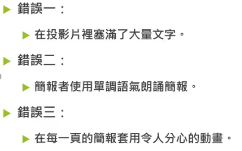
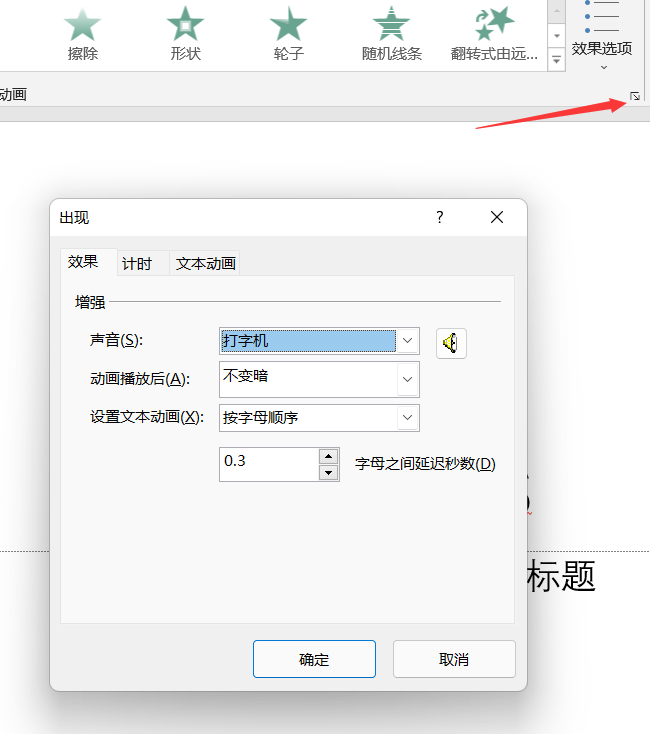
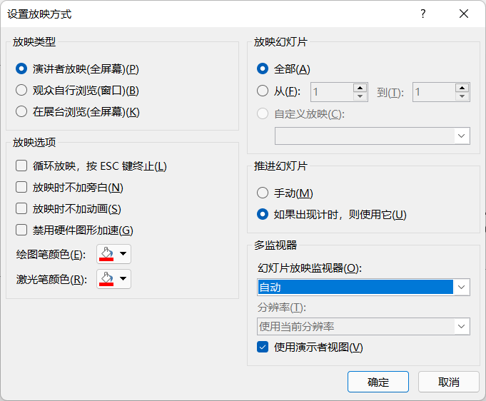
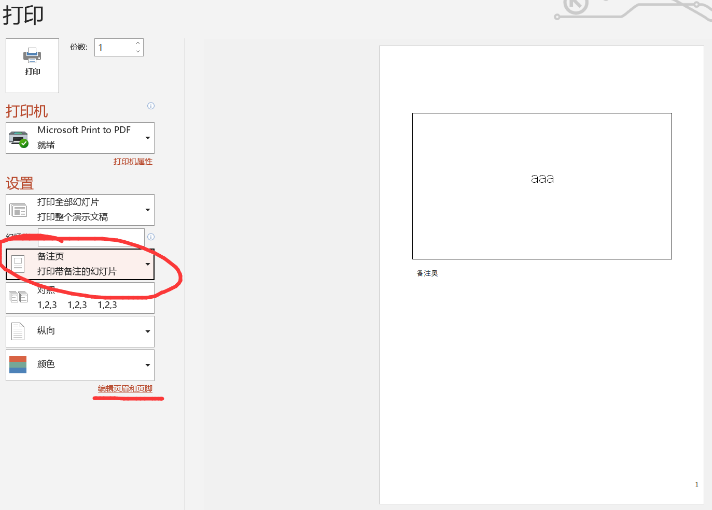
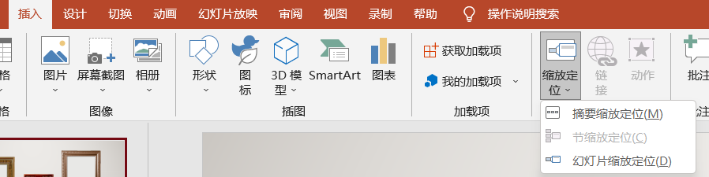
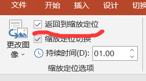
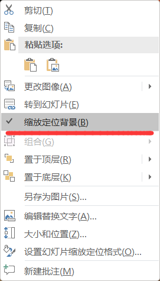
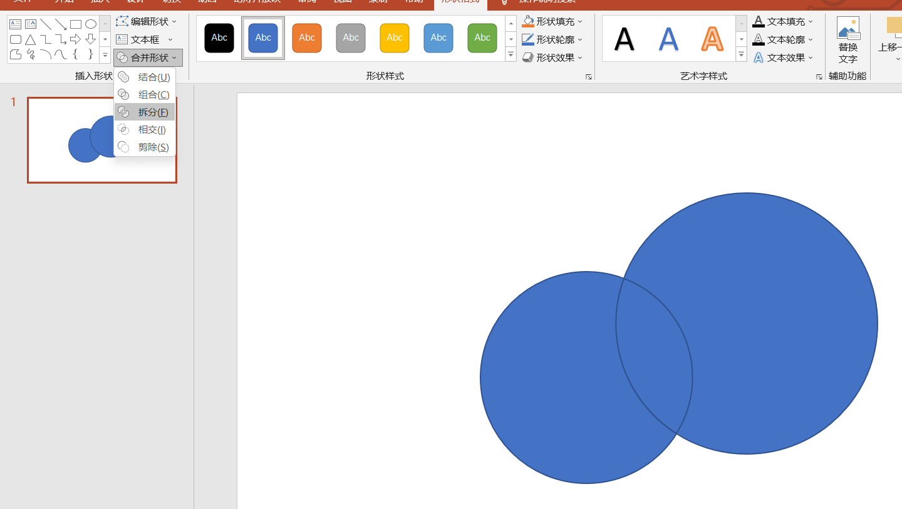

# PPT learning

{width="4.0in" height="2.5in"}

添加动画------叠加动画

复制动画

动画窗格 修改顺序

![]](../media/学习笔记-PPT-learning-image2.png){width="4.7in" height="1.7166666666666666in"}

alt+shift+方向键 移动整个段落

{width="3.725in" height="4.208333333333333in"}

图案对齐：多选 格式 排列

图表动画：效果选项

{width="4.166666666666667in" height="3.441666666666667in"}

{width="5.875in" height="4.208333333333333in"}

幻灯片缩放

{width="4.541666666666667in" height="1.1333333333333333in"}

{width="2.375in" height="1.3333333333333333in"}

{width="1.325in" height="2.316666666666667in"}

{width="5.825in" height="3.2916666666666665in"}

合并形状

视差效果 利用元素移动终点不同

调色盘

好的ppt一切从简

alt+f10 选取菜单