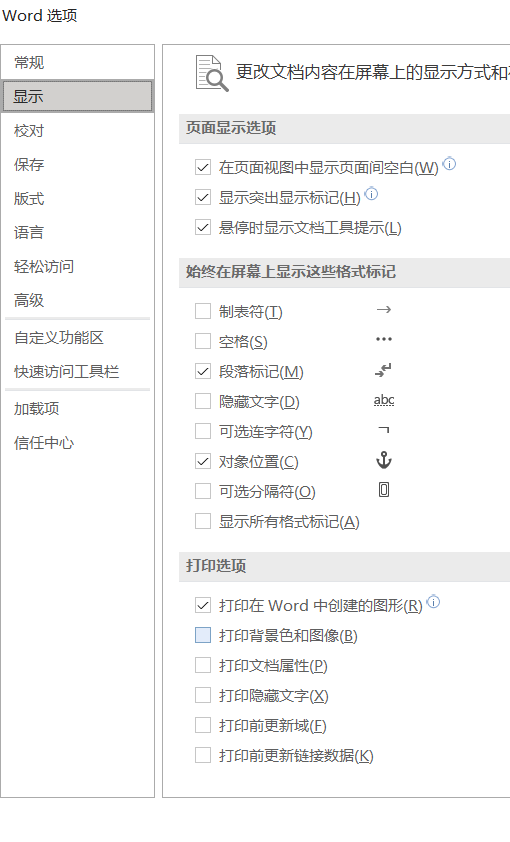

# Word Learning

剪贴簿
win + v

上一页ctrl+pgup

下一页ctrl+pgdn

第一页ctrl+home

最后一页ctrl+end

视图------缩放------单页/多页

{width="3.075in" height="3.2583333333333333in"}

标题排版技巧

{width="3.625in" height="3.6in"}

{width="3.0in" height="5.066666666666666in"}

图片 插入后选中 图片格式

环绕文字 编辑环绕节点

还可以删除背景

裁剪 里面可以填充

标尺 定位点

视图------显示------标尺

标尺只影响光标所在段落

可以全选再操作

{width="0.675in" height="0.3416666666666667in"}

上面的是首行缩进

下面三角形是左/右缩进

灰色是边界 控制页边距

或者在 布局 里面修改

{width="1.275in" height="1.4083333333333334in"}

制表符

要有Tab缩进才能用

添加到标尺里就能用

按住制表符向外面拖就可以删除

分散对齐 类似于菜单

插入------页面------分页 ctrl+enter

{width="4.783333333333333in" height="1.5416666666666667in"}

页眉 页尾

双击页眉/页尾即可修改

页码

选项------首页不同

1.  自定义快速访问工具栏 word左上角

2.  查找和替代 ctrl+f ctrl+h

3.  复制格式 光标选择有格式的文字等元素

然后剪贴板------格式刷

ctrl + shift + c/v

{width="3.4916666666666667in" height="5.758333333333334in"}

打印背景色和图像

文本框 预设格式

形状格式------文本------对齐文本

形状格式------文本------创建连接 可以将两个文本框连接起来

当第一个文本框不够显示时放到第二个里面

word表格

新增预设

插入------表格

合并单元格

表格函数

分割表格 分割单元格

表格文字如何对齐：表格布局------对齐方式

底线可以用定位点 ctrl+tab在表格里输入tab

绘制表格

可以直接用表格框线当作底线

边框刷

邮件合并打印 比如信封 邀请函 奖状等

邮件------开始邮件合并------选择收信人------打开带有名单的word或excel文档

导入后在编写和插入域中------插入合并域

预览结果

规则里面可以匹配字段

竖式排版

文字方向

阿拉伯数字 全角半角shift+space

１２３４５12345

按住ctrl键再拖动可以快速复制

目录制作

标题要在样式里选取 不是单纯放大文字

分页：ctrl+enter

然后在引用------目录中插入目录 动态更新

选择目录------更新目录

导航：视图------显示------导航窗格

多层目录（章节）

{width="2.908333333333333in" height="4.033333333333333in"}

光标放在标题前按TAB键------降低层次

shift+tab------提高层次

{width="6.291666666666667in" height="4.608333333333333in"}

方便的段前分页

画布可以有效地移动多个物件

记住对齐永远有用！！

流程图 Smart Art

图表标号（即图1-1这种）

{width="4.491666666666666in" height="1.5083333333333333in"}

{width="5.558333333333334in" height="2.8333333333333335in"}

crtl+G 跳转

f9 更新

交叉引用

插入表目录

图表目录

分节符号 将一个文件分成不同章节

{width="3.466666666666667in" height="5.825in"}

{width="5.958333333333333in" height="5.25in"}

分完节后就可以单独设置

{width="6.166666666666667in" height="3.1083333333333334in"}

{width="3.0083333333333333in" height="1.4583333333333333in"}

这个关掉就可以修改前一面的页眉/页脚而不影响后面

分栏排版

{width="3.3666666666666667in" height="5.366666666666666in"}

{width="4.408333333333333in" height="4.208333333333333in"}

修订

审阅------修订

记录两种：删增、格式变化

{width="3.2416666666666667in" height="1.0in"}

接受/拒绝 ------ 应用/拒绝变更

{width="1.5333333333333334in" height="1.3333333333333333in"}

比较

{width="2.066666666666667in" height="2.55in"}

表单制作

首先先找到开发工具tab

!](../media/学习笔记-Word-Learning-image21.png){width="4.875in" height="3.95in"}

{width="2.175in" height="1.3333333333333333in"}

这些控件就可以实现基本的输入了

设计模式可以避免输入 调整控件样式 还可以设置placeholder：

{width="3.033333333333333in" height="2.033333333333333in"}

勾选框------属性里面可以设置勾选样式 wingding2里面有方块勾叉

限制编辑：

{width="5.75in" height="3.425in"}

段落标记

手动分行

{width="0.7583333333333333in" height="0.5416666666666666in"}

两者不同

{width="2.4166666666666665in" height="4.908333333333333in"}

**alt+f9 显示变量**

{width="4.325in" height="2.625in"}

{width="5.008333333333334in" height="3.6666666666666665in"}

原理：从excel表格中读取文件路径（  替换成  ）

通过插入includePicture域读取图片

规则里面有下一

文字靠左 金额靠右

重心在中间

横竖线取舍

样式

优先级：手动》字符》段落

阶层（大纲级别）

{width="2.3666666666666667in" height="3.283333333333333in"}

