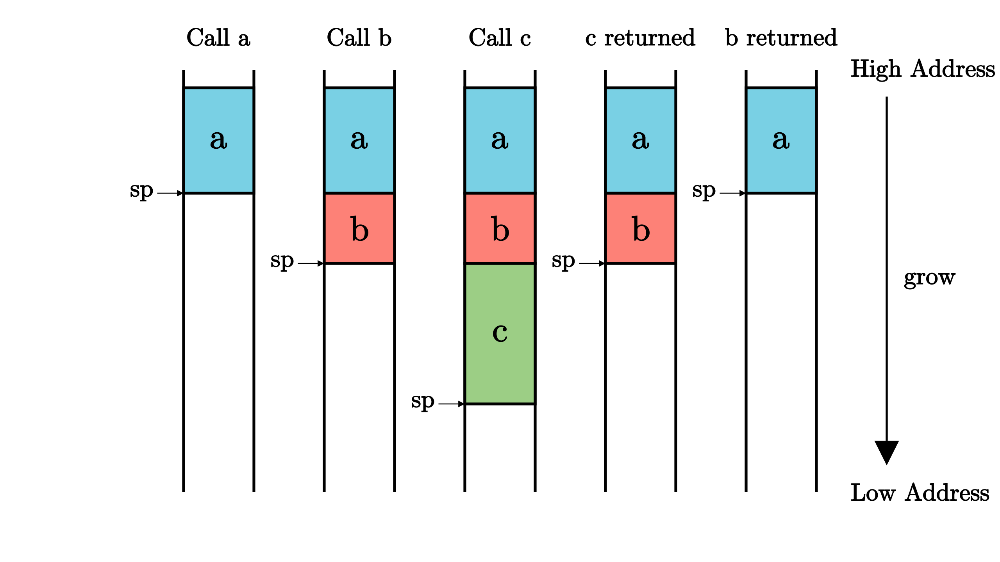
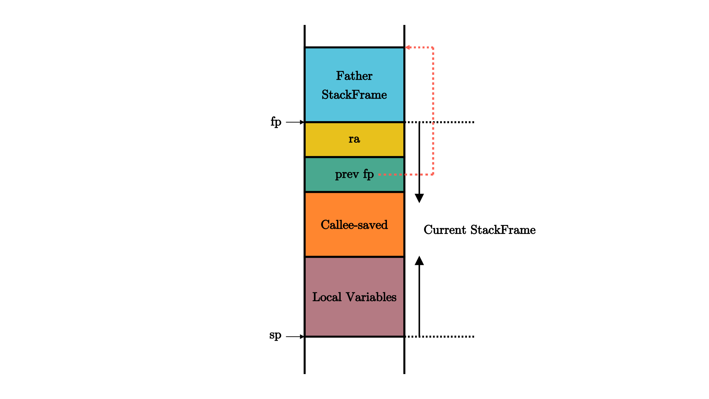

# rCore ch1

## 移除标准库依赖

```rust
// os/src/main.rs
#![no_main]
#![no_std]
mod lang_items;
// ... other code


// os/src/lang_items.rs
use core::panic::PanicInfo;

#[panic_handler]
fn panic(_info: &PanicInfo) -> ! {
    loop {}
}
```


首先我们需要通过链接脚本调整内核可执行文件的内存布局，使得内核被执行的第一条指令位于地址 `0x80200000` 处，同时代码段所在的地址应低于其他段。这是因为 Qemu 物理内存中低于 `0x80200000` 的区域并未分配给内核，而是主要由 RustSBI  使用。其次，我们需要将内核可执行文件中的元数据丢掉得到内核镜像，此内核镜像仅包含实际会用到的代码和数据。这则是因为 Qemu  的加载功能过于简单直接，它直接将输入的文件逐字节拷贝到物理内存中，因此也可以说这一步是我们在帮助 Qemu  手动将可执行文件加载到物理内存中。下一节我们将成功生成内核镜像并在 Qemu 上验证控制权被转移到内核。

## 编写内核第一条指令

首先，我们需要编写进入内核后的第一条指令，这样更方便我们验证我们的内核镜像是否正确对接到 Qemu 上。

```
 # os/src/entry.asm
     .section .text.entry
     .globl _start
 _start:
     li x1, 100
```

实际的指令位于第 5 行，也即 `li x1, 100` 。 `li` 是 Load Immediate 的缩写，也即将一个立即数加载到某个寄存器，因此这条指令可以看做将寄存器 `x1` 赋值为 `100` 。第 4 行我们声明了一个符号 `_start` ，该符号指向紧跟在符号后面的内容——也就是位于第 5 行的指令，因此符号 `_start` 的地址即为第 5 行的指令所在的地址。第 3 行我们告知编译器 `_start` 是一个全局符号，因此可以被其他目标文件使用。第 2 行表明我们希望将第 2 行后面的内容全部放到一个名为 `.text.entry` 的段中。一般情况下，所有的代码都被放到一个名为 `.text` 的代码段中，这里我们将其命名为 `.text.entry` 从而区别于其他 `.text` 的目的在于我们想要确保该段被放置在相比任何其他代码段更低的地址上。这样，作为内核的入口点，这段指令才能被最先执行。

接着，我们在 `main.rs` 中嵌入这段汇编代码，这样 Rust 编译器才能够注意到它，不然编译器会认为它是一个与项目无关的文件：

```
// os/src/main.rs
#![no_std]
#![no_main]

mod lang_item;

use core::arch::global_asm;
global_asm!(include_str!("entry.asm"));
```


## 手动加载内核可执行文件

上面得到的内核可执行文件完全符合我们对于内存布局的要求，但是我们不能将其直接提交给 Qemu ，因为它除了实际会被用到的代码和数据段之外还有一些多余的元数据，这些元数据无法被 Qemu 在加载文件时利用，且会使代码和数据段被加载到错误的位置。如下图所示：


丢弃元数据前后的内核可执行文件被加载到 Qemu 上的情形

## GDB 调试

```shell
qemu-system-riscv64 \
    -machine virt \
    -nographic \
    -bios ../bootloader/rustsbi-qemu.bin \
    -device loader,file=target/riscv64gc-unknown-none-elf/release/os.bin,addr=0x80200000 \
    -s -S
```

```shell
riscv64-unknown-elf-gdb \
    -ex 'file target/riscv64gc-unknown-none-elf/release/os' \
    -ex 'set arch riscv:rv64' \
    -ex 'target remote localhost:1234'
```


函数调用上下文中的寄存器被分为如下两类：


- **被调用者保存(Callee-Saved) 寄存器** ：被调用的函数可能会覆盖这些寄存器，需要被调用的函数来保存的寄存器，即由被调用的函数来保证在调用前后，这些寄存器保持不变；
- **调用者保存(Caller-Saved) 寄存器** ：被调用的函数可能会覆盖这些寄存器，需要发起调用的函数来保存的寄存器，即由发起调用的函数来保证在调用前后，这些寄存器保持不变。

从名字中可以看出，函数调用上下文由调用者和被调用者分别保存，其具体过程分别如下：

- 调用函数：首先保存不希望在函数调用过程中发生变化的 **调用者保存寄存器** ，然后通过 jal/jalr 指令调用子函数，返回之后恢复这些寄存器。
- 被调用函数：在被调用函数的起始，先保存函数执行过程中被用到的 **被调用者保存寄存器** ，然后执行函数，最后在函数退出之前恢复这些寄存器。

我们发现无论是调用函数还是被调用函数，都会因调用行为而需要两段匹配的保存和恢复寄存器的汇编代码，可以分别将其称为 **开场** (Prologue) 和 **结尾** (Epilogue)，它们会由编译器帮我们自动插入，来完成相关寄存器的保存与恢复。一个函数既有可能作为调用者调用其他函数，也有可能作为被调用者被其他函数调用。

## 调用规范

**调用规范** (Calling Convention) 约定在某个指令集架构上，某种编程语言的函数调用如何实现。它包括了以下内容：

1. 函数的输入参数和返回值如何传递；
2. 函数调用上下文中调用者/被调用者保存寄存器的划分；
3. 其他的在函数调用流程中对于寄存器的使用方法。

-   zero( `x0` ) 之前提到过，它恒为零，函数调用不会对它产生影响；
-   ra( `x1` ) 是调用者保存的，不过它并不会在每次调用子函数的时候都保存一次，而是在函数的开头和结尾保存/恢复即可。虽然 `ra` 看上去和其它被调用者保存寄存器保存的位置一样，但是它确实是调用者保存的。
-   sp( `x2` ) 是被调用者保存的。这个是之后就会提到的栈指针 (Stack Pointer) 寄存器。
-   fp( `s0` )，它既可作为s0临时寄存器，也可作为栈帧指针（Frame Pointer）寄存器，表示当前栈帧的起始位置，是一个被调用者保存寄存器。
-   gp( `x3` ) 和 tp( `x4` ) 在一个程序运行期间都不会变化，因此不必放在函数调用上下文中。它们的用途在后面的章节会提到。

## 栈与栈帧

  `sp` 寄存器常用来保存 **栈指针** (Stack Pointer)，它指向内存中栈顶地址。在 RISC-V 架构中，栈是从高地址向低地址增长的。

在一个函数中，作为起始的开场代码负责分配一块新的栈空间，即将 `sp` 的值减小相应的字节数即可，于是物理地址区间 新旧 对应的物理内存的一部分便可以被这个函数用来进行函数调用上下文的保存/恢复，这块物理内存被称为这个函数的 **栈帧** (Stackframe)。

同理，函数中的结尾代码负责将开场代码分配的栈帧回收，这也仅仅需要将 `sp` 的值增加相同的字节数回到分配之前的状态。这也可以解释为什么 `sp` 是一个被调用者保存寄存器。



在合适的编译选项设置之下，一个函数的栈帧内容可能如下图所示：



它的开头和结尾分别在 `sp`(`x2`) 和 `fp`(`s0`) 所指向的地址。按照地址从高到低分别有以下内容，它们都是通过 `sp` 加上一个偏移量来访问的：

- `ra` 寄存器保存其返回之后的跳转地址，是一个调用者保存寄存器；
- 父亲栈帧的结束地址 `fp` ，是一个被调用者保存寄存器；
- 其他被调用者保存寄存器 `s1` ~ `s11` ；
- 函数所使用到的局部变量。