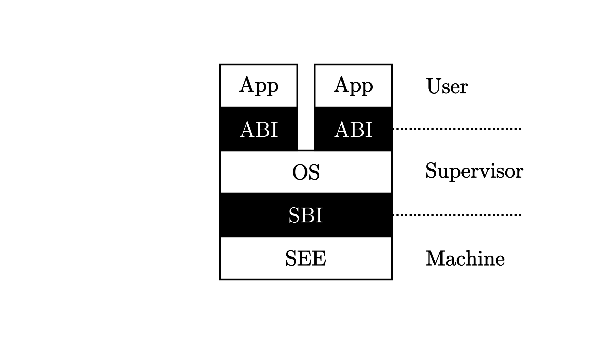

# 应用程序

## 导读

*保护* 计算机系统不受有意或无意出错的程序破坏的机制被称为 **特权级** (Privilege) 机制，它让应用程序运行在用户态，而操作系统运行在内核态，且实现用户态和内核态的隔离，这需要计算机软件和硬件的共同努力。

...

### 特权级机制

为了保护我们的批处理操作系统不受到出错应用程序的影响并全程稳定工作，单凭软件实现是很难做到的，而是需要 CPU 提供一种特权级隔离机制，使 CPU 在执行应用程序和操作系统内核的指令时处于不同的特权级。

为了实现这样的特权级机制，需要进行软硬件协同设计。一个比较简洁的方法就是，处理器设置两个不同安全等级的执行环境：用户态特权级的执行环境和内核态特权级的执行环境。


为了让应用程序获得操作系统的函数服务，采用传统的函数调用方式（即通常的 `call` 和 `ret` 指令或指令组合）将会直接绕过硬件的特权级保护检查。所以可以设计新的机器指令：执行环境调用（Execution Environment Call，简称 `ecall` ）和执行环境返回(Execution Environment Return，简称 `eret` )）：

- `ecall` ：具有用户态到内核态的执行环境切换能力的函数调用指令
- `eret` ：具有内核态到用户态的执行环境切换能力的函数返回指令


### RISC-V 特权级架构

RISC-V 架构中一共定义了 4 种特权级：

| 级别 | 编码 | 名称                                |
| ---- | ---- | ----------------------------------- |
| 0    | 00   | 用户/应用模式 (U, User/Application) |
| 1    | 01   | 监督模式 (S, Supervisor)            |
| 2    | 10   | 虚拟监督模式 (H, Hypervisor)        |
| 3    | 11   | 机器模式 (M, Machine)               |

其中，级别的数值越大，特权级越高，掌控硬件的能力越强。从表中可以看出， M 模式处在最高的特权级，而 U 模式处于最低的特权级。在CPU硬件层面，除了M模式必须存在外，其它模式可以不存在。



操作系统内核代码运行在 S 模式上；应用程序运行在 U 模式上。运行在 M 模式上的软件被称为 **监督模式执行环境** (SEE, Supervisor Execution Environment)，如在操作系统运行前负责加载操作系统的 Bootloader – RustSBI。

当执行环境的代码运行结束后，我们需要回到上层软件暂停的位置继续执行。在 RISC-V 架构中，这种与常规控制流（顺序、循环、分支、函数调用）不同的 **异常控制流** (ECF, Exception Control Flow) 被称为 **异常（Exception）** ，是 RISC-V 语境下的 Trap 种类之一。

![[Pasted image 20221105165217.png]]

## 实现应用程序

应用程序、用户库（包括入口函数、初始化函数、I/O 函数和系统调用接口等多个 rs 文件组成）放在项目根目录的 `user` 目录下，它和第一章的裸机应用不同之处主要在项目的目录文件结构和内存布局上：

-   `user/src/bin/*.rs` ：各个应用程序
-   `user/src/*.rs` ：用户库（包括入口函数、初始化函数、I/O 函数和系统调用接口等）
-   `user/src/linker.ld` ：应用程序的内存布局说明。

## 内存布局

在 `user/.cargo/config` 中，我们和第一章一样设置链接时使用链接脚本 `user/src/linker.ld` 。在其中我们做的重要的事情是：

-   将程序的起始物理地址调整为 `0x80400000` ，三个应用程序都会被加载到这个物理地址上运行；
-   将 `_start` 所在的 `.text.entry` 放在整个程序的开头，也就是说批处理系统只要在加载之后跳转到 `0x80400000` 就已经进入了 用户库的入口点，并会在初始化之后跳转到应用程序主逻辑；
-   提供了最终生成可执行文件的 `.bss` 段的起始和终止地址，方便 `clear_bss` 函数使用。

## 系统调用

通过`asm!`宏将汇编嵌入到rust代码中，封装为`syscall`函数
```rust
// user/src/syscall.rs
use core::arch::asm;
fn syscall(id: usize, args: [usize; 3]) -> isize {
    let mut ret: isize;
    unsafe {
        asm!(
            "ecall",
            inlateout("x10") args[0] => ret,
            in("x11") args[1],
            in("x12") args[2],
            in("x17") id
        );
    }
    ret
}

const SYSCALL_WRITE: usize = 64;
const SYSCALL_EXIT: usize = 93;

pub fn sys_write(fd: usize, buffer: &[u8]) -> isize {
    syscall(SYSCALL_WRITE, [fd, buffer.as_ptr() as usize, buffer.len()])
}

pub fn sys_exit(xstate: i32) -> isize {
    syscall(SYSCALL_EXIT, [xstate as usize, 0, 0])
}
```

x17寄存器用于ecall读取系统调用ID
x10作为输入输出变量
x11和x12作为不同的输入变量，根据系统调用需求传入

传入不同参数，封装为`sys_write`/`sys_exit`函数

将上述两个系统调用在用户库 `user_lib` 中进一步封装，从而更加接近在 Linux 等平台的实际系统调用接口：
```rust
// user/src/lib.rs
use syscall::*;
pub fn write(fd: usize, buf: &[u8]) -> isize { sys_write(fd, buf) }
pub fn exit(exit_code: i32) -> isize { sys_exit(exit_code) }
```

给 `Stdout` 这个元结构一个 `Write` Trait：
```rust
// user/src/console.rs
struct Stdout;
const STDOUT: usize = 1;
impl Write for Stdout {
    fn write_str(&mut self, s: &str) -> fmt::Result {
        write(STDOUT, s.as_bytes());
        Ok(())
    }
}
```

`exit` 在`_start` 内调用，main返回时使用它来退出应用程序并将返回值返回底层的批处理系统。

## 编译应用程序

通过Makefile构建：`make build`

```
TARGET := riscv64gc-unknown-none-elf
MODE := release
APP_DIR := src/bin
TARGET_DIR := target/$(TARGET)/$(MODE)
APPS := $(wildcard $(APP_DIR)/*.rs)
ELFS := $(patsubst $(APP_DIR)/%.rs, $(TARGET_DIR)/%, $(APPS))
BINS := $(patsubst $(APP_DIR)/%.rs, $(TARGET_DIR)/%.bin, $(APPS))

OBJDUMP := rust-objdump --arch-name=riscv64
OBJCOPY := rust-objcopy --binary-architecture=riscv64

elf
:
	@cargo build --release
	@echo $(APPS)
	@echo $(ELFS)
	@echo $(BINS)

binary: elf
	$(foreach elf, $(ELFS), $(OBJCOPY) $(elf) --strip-all -O binary $(patsubst $(TARGET_DIR)/%, $(TARGET_DIR)/%.bin, $(elf));)

build: binary
```

## 执行应用程序

> Qemu 有两种运行模式：用户态模拟（User mode）和系统级模拟（System mode）。在 RISC-V 架构中，用户态模拟可使用 `qemu-riscv64` 模拟器，它可以模拟一台预装了 Linux 操作系统的 RISC-V 计算机。但是一般情况下我们并不通过输入命令来与之交互（就像我们正常使用 Linux 操作系统一样），它仅支持载入并执行单个可执行文件。具体来说，它可以解析基于 RISC-V 的应用级 ELF 可执行文件，加载到内存并跳转到入口点开始执行。在翻译并执行指令时，如果碰到是系统调用相关的汇编指令，它会把不同处理器（如 RISC-V）的 Linux 系统调用转换为本机处理器（如 x86-64）上的 Linux 系统调用，这样就可以让本机 Linux 完成系统调用，并返回结果（再转换成 RISC-V 能识别的数据）给这些应用。相对的，我们使用 `qemu-system-riscv64` 模拟器来系统级模拟一台 RISC-V 64 裸机，它包含处理器、内存及其他外部设备，支持运行完整的操作系统。

通过 `qemu-riscv64` 执行应用程序：
```shell
qemu-riscv64 ./target/riscv64gc-unknown-none-elf/release/00hello_world

H3ll0, w0r1d!
[INFO] executed hello_world.
[DEBUG] debug message from hello_worldH3ll0, w0r1d!
```

# 批处理系统

-   静态绑定：通过一定的编程技巧，把多个应用程序代码和批处理操作系统代码“绑定”在一起。
    
-   动态加载：基于静态编码留下的“绑定”信息，操作系统可以找到每个应用程序文件二进制代码的起始地址和长度，并能加载到内存中运行。

在本章中，我们把应用程序的二进制镜像文件（从 ELF 格式可执行文件剥离元数据）作为内核的数据段链接到内核里面，因此内核需要知道内含的应用程序的数量和它们的位置，这样才能够在运行时对它们进行管理并能够加载到物理内存。

在 `os/src/main.rs` 中能够找到这样一行：
```rust
global_asm!(include_str!("link_app.S"));
```

能够找到并加载应用程序二进制码的应用管理器 `AppManager` 是“邓式鱼”操作系统的核心组件。我们在 `os` 的 `batch` 子模块中实现一个应用管理器，它的主要功能是：

-   保存应用数量和各自的位置信息，以及当前执行到第几个应用了。
-   根据应用程序位置信息，初始化好应用所需内存空间，并加载应用执行。

我们希望AppManager是个全局都可以访问的变量，任何函数都可以访问，其中的变量会随着运行时而变化，我们按理可以使用Rust的`RefCell`来包裹AppManager，但是由于Rust默认程序员在多线程上使用它，`RefCell`不是线程安全的，所以将其声明为static全局变量会报错：没有实现Sync Trait，而我们只需要实现单核单线程又需要全局的RefCell，可以简单的对RefCell进行包装：

```rust
// os/src/sync/up.rs

pub struct UPSafeCell<T> {
    /// inner data
    inner: RefCell<T>,
}

unsafe impl<T> Sync for UPSafeCell<T> {}

impl<T> UPSafeCell<T> {
    /// User is responsible to guarantee that inner struct is only used in
    /// uniprocessor.
    pub unsafe fn new(value: T) -> Self {
        Self { inner: RefCell::new(value) }
    }
    /// Panic if the data has been borrowed.
    pub fn exclusive_access(&self) -> RefMut<'_, T> {
        self.inner.borrow_mut()
    }
}
```

调用 `exclusive_access` 可以得到它包裹的数据的独占访问权。因此当我们要访问数据时（无论读还是写），需要首先调用 `exclusive_access` 获得数据的可变借用标记，通过它可以完成数据的读写，在操作完成之后我们需要销毁这个标记，此后才能开始对该数据的下一次访问。相比 `RefCell` 它不再允许多个读操作同时存在。

初始化 AppManager 代码：
```rust
// os/src/batch.rs

lazy_static! {
    static ref APP_MANAGER: UPSafeCell<AppManager> = unsafe { UPSafeCell::new({
        extern "C" { fn _num_app(); }
        let num_app_ptr = _num_app as usize as *const usize;
        let num_app = num_app_ptr.read_volatile();
        let mut app_start: [usize; MAX_APP_NUM + 1] = [0; MAX_APP_NUM + 1];
        let app_start_raw: &[usize] =  core::slice::from_raw_parts(
            num_app_ptr.add(1), num_app + 1
        );
        app_start[..=num_app].copy_from_slice(app_start_raw);
        AppManager {
            num_app,
            current_app: 0,
            app_start,
        }
    })};
}
```

`lazy_static!` 宏提供了全局变量的运行时初始化功能。一般情况下，全局变量必须在编译期设置一个初始值，但是有些全局变量依赖于运行期间才能得到的数据作为初始值。这导致这些全局变量需要在运行时发生变化，即需要重新设置初始值之后才能使用。如果我们手动实现的话有诸多不便之处，比如需要把这种全局变量声明为 `static mut` 并衍生出很多 unsafe 代码 。这种情况下我们可以使用 `lazy_static!` 宏来帮助我们解决这个问题。这里我们借助 `lazy_static!` 声明了一个 `AppManager` 结构的名为 `APP_MANAGER` 的全局实例，且只有在它第一次被使用到的时候，才会进行实际的初始化工作。

因此，借助我们设计的 `UPSafeCell<T>` 和外部库 `lazy_static!`，我们就能使用尽量少的 unsafe 代码完成可变全局变量的声明和初始化，且一旦初始化完成，在后续的使用过程中便不再触及 unsafe 代码。

`AppManager` 的方法中， `print_app_info/get_current_app/move_to_next_app` 都相当简单直接，需要说明的是 `load_app`

我们首先将一块内存清空，然后找到待加载应用二进制镜像的位置，并将它复制到正确的位置。它本质上是把数据从一块内存复制到另一块内存，从批处理操作系统的角度来看，是将操作系统数据段的一部分数据（实际上是应用程序）复制到了一个可以执行代码的内存区域。在这一点上也体现了冯诺依曼计算机的 _代码即数据_ 的特征。


# 特权级切换

批处理操作系统被设计为运行在内核态特权级（RISC-V 的 S 模式），这是作为 SEE（Supervisor Execution Environment）的 RustSBI 所保证的。而应用程序被设计为运行在用户态特权级（RISC-V 的 U 模式），被操作系统为核心的执行环境监管起来。

-   当启动应用程序的时候，需要初始化应用程序的用户态上下文，并能切换到用户态执行应用程序；
    
-   当应用程序发起系统调用（即发出 Trap）之后，需要到批处理操作系统中进行处理；
    
-   当应用程序执行出错的时候，需要到批处理操作系统中杀死该应用并加载运行下一个应用；
    
-   当应用程序执行结束的时候，需要到批处理操作系统中加载运行下一个应用（实际上也是通过系统调用 `sys_exit` 来实现的）。

我们仅考虑如下流程：当 CPU 在用户态特权级（ RISC-V 的 U 模式）运行应用程序，执行到 Trap，切换到内核态特权级（ RISC-V的S 模式），批处理操作系统的对应代码响应 Trap，并执行系统调用服务，处理完毕后，从内核态返回到用户态应用程序继续执行后续指令。

只要是 Trap 到 S 特权级，操作系统就会使用 S 特权级中与 Trap 相关的 **控制状态寄存器** (CSR, Control and Status Register) 来辅助 Trap 处理。

sstatus
`SPP` 等字段给出 Trap 发生之前 CPU 处在哪个特权级（S/U）等信息

sepc
当 Trap 是一个异常的时候，记录 Trap 发生之前执行的最后一条指令的地址

注意 `sstatus` 是 S 特权级最重要的 CSR，可以从多个方面控制 S 特权级的 CPU 行为和执行状态。


与函数调用需要保存函数调用上下文/活动记录一样，在执行操作系统的 Trap 处理过程（会修改通用寄存器）之前，我们需要在某个地方（某内存块或内核的栈）保存这些寄存器并在 Trap 处理结束后恢复这些寄存器。
除了通用寄存器之外还有一些可能在处理 Trap 过程中会被修改的 CSR，比如 CPU 所在的特权级。我们要保证它们的变化在我们的预期之内。

## 特权级切换硬件机制

当 CPU 执行完一条指令（如 `ecall` ）并准备从用户特权级 陷入（ `Trap` ）到 S 特权级的时候，硬件会自动完成如下这些事情：

-   `sstatus` 的 `SPP` 字段会被修改为 CPU 当前的特权级（U/S）。
-   `sepc` 会被修改为 Trap 处理完成后默认会执行的下一条指令的地址。
-   `scause/stval` 分别会被修改成这次 Trap 的原因以及相关的附加信息。
-   CPU 会跳转到 `stvec` 所设置的 Trap 处理入口地址，并将当前特权级设置为 S ，然后从Trap 处理入口地址处开始执行。

而当 CPU 完成 Trap 处理准备返回的时候，需要通过一条 S 特权级的特权指令 `sret` 来完成，这一条指令具体完成以下功能：

-   CPU 会将当前的特权级按照 `sstatus` 的 `SPP` 字段设置为 U 或者 S ；
-   CPU 会跳转到 `sepc` 寄存器指向的那条指令，然后继续执行。

## 用户栈和内核栈

使用两个不同的栈主要是为了安全性：如果两个控制流（即应用程序的控制流和内核的控制流）使用同一个栈，在返回之后应用程序就能读到 Trap 控制流的历史信息，比如内核一些函数的地址，这样会带来安全隐患。于是，我们要做的是，在批处理操作系统中添加一段汇编代码，实现从用户栈切换到内核栈，并在内核栈上保存应用程序控制流的寄存器状态。

我们声明两个类型 `KernelStack` 和 `UserStack` 分别表示用户栈和内核栈，它们都只是字节数组的简单包装，以全局变量的形式实例化在批处理操作系统的 `.bss` 段中的。

我们为两个类型实现了 `get_sp` 方法来获取栈顶地址。由于在 RISC-V 中栈是向下增长的，我们只需返回包裹的数组的结尾地址：
```rust
impl KernelStack {
    fn get_sp(&self) -> usize {
        self.data.as_ptr() as usize + KERNEL_STACK_SIZE
    } 
}
```

于是换栈是非常简单的，只需将 `sp` 寄存器的值修改为 `get_sp` 的返回值即可。

Trap上下文（即数据结构 `TrapContext` ），类似前面提到的函数调用上下文，即在 Trap 发生时需要保存的物理资源内容，并将其一起放在一个名为 `TrapContext` 的类型中，定义如下：
```rust
// os/src/trap/context.rs

#[repr(C)]
pub struct TrapContext {
    pub x: [usize; 32],
    pub sstatus: Sstatus,
    pub sepc: usize,
}
```
可以看到里面包含所有的通用寄存器 `x0~x31` ，还有 `sstatus` 和 `sepc` 。那么为什么需要保存它们呢？

虽然在 Trap 控制流中只是会执行 Trap 处理相关的代码，但依然可能直接或间接调用很多模块，因此很难甚至不可能找出哪些寄存器无需保存。既然如此我们就只能全部保存了。

## Trap 管理

-   应用程序通过 `ecall` 进入到内核状态时，操作系统保存被打断的应用程序的 Trap 上下文；
    
-   操作系统根据Trap相关的CSR寄存器内容，完成系统调用服务的分发与处理；
    
-   操作系统完成系统调用服务后，需要恢复被打断的应用程序的Trap 上下文，并通 `sret` 让应用程序继续执行。

### 上下文保存/恢复

批处理系统初始化时，修改`stvec`寄存器来指向正确的 Trap处理入口点；
```rust
// os/src/trap/mod.rs

global_asm!(include_str!("trap.S"));

pub fn init() {
    extern "C" { fn __alltraps(); }
    unsafe {
        stvec::write(__alltraps as usize, TrapMode::Direct);
    }
}
```

这里我们引入了一个外部符号 `__alltraps` ，并将 `stvec` 设置为 Direct 模式指向它的地址。我们在 `os/src/trap/trap.S` 中实现 Trap 上下文保存/恢复的汇编代码，分别用外部符号 `__alltraps` 和 `__restore` 标记为函数，并通过 `global_asm!` 宏将 `trap.S` 这段汇编代码插入进来。

首先通过 `__alltraps` 将 Trap 上下文保存在内核栈上，然后跳转到使用 Rust 编写的 `trap_handler` 函数完成 Trap 分发及处理。当 `trap_handler` 返回之后，使用 `__restore` 从保存在内核栈上的 Trap 上下文恢复寄存器。最后通过一条 `sret` 指令回到应用程序执行。


**sscratch CSR 的用途**

在特权级切换的时候，我们需要将 Trap 上下文保存在内核栈上，因此需要一个寄存器暂存内核栈地址，并以它作为基地址指针来依次保存 Trap 上下文的内容。但是所有的通用寄存器都不能够用作基地址指针，因为它们都需要被保存，如果覆盖掉它们，就会影响后续应用控制流的执行。

事实上我们缺少了一个重要的中转寄存器，而 `sscratch` CSR 正是为此而生。从上面的汇编代码中可以看出，在保存 Trap 上下文的时候，它起到了两个作用：首先是保存了内核栈的地址，其次它可作为一个中转站让 `sp` （目前指向的用户栈的地址）的值可以暂时保存在 `sscratch` 。这样仅需一条 `csrrw  sp, sscratch, sp` 指令（交换对 `sp` 和 `sscratch` 两个寄存器内容）就完成了从用户栈到内核栈的切换，这是一种极其精巧的实现。

## 分发与管理

使用Rust实现 `trap_handler` 进行trap分发与管理

```rust


use crate::syscall::syscall;
use crate::batch::run_next_app;
use core::arch::global_asm;
use riscv::register::{
    mtvec::TrapMode,
    scause::{self, Exception, Trap},
    stvec,stval,
};
pub use context::TrapContext;

#[no_mangle]
pub fn trap_handler(cx: &mut TrapContext) -> &mut TrapContext {
    let scause = scause::read();
    let stval = stval::read();
    match scause.cause() {
        Trap::Exception(Exception::UserEnvCall) => {
            cx.sepc += 4; // sepc + len(ecall) = sepc + 4
            cx.x[10] = syscall(cx.x[17], [cx.x[10], cx.x[11], cx.x[12]]) as usize;
        }
        Trap::Exception(Exception::IllegalInstruction) => {
            warn!("[KERNEL] IllegelInstruction in application, kernel killed it.");
            run_next_app();
        }
        Trap::Exception(Exception::StoreFault) | Trap::Exception(Exception::StorePageFault) => {
            warn!("[KERNEL] Pagefault in application, kernel killed it.");
            run_next_app();
        }
        _ => {
            panic!("Unsupported trap {:?} in application, stval = {:#x}", scause.cause(), stval);
        }
    }
    cx
}
```

使用rustv库中提供的寄存器接口对CSR寄存器进行读取，
`scause` 寄存器储存Trap的各种信息，如 `Exception` ，可以通过match不同的异常从而实现不同的功能。

## 实现系统调用

`syscall` 函数本身不执行任何系统调用，而是将参数match到不同的分支，实现不同的功能：

```rust
pub fn syscall(syscall_id: usize, args: [usize; 3]) -> usize {
    match syscall_id {
        SYSCALL_WRITE => sys_write(args[0], args[1] as *const u8, args[2]),
        SYSCALL_EXIT => sys_exit(args[0] as i32),
        _ => panic!("Unsupported syscall_id: {}", syscall_id),
    }
}
```


## 执行应用程序

当批处理操作系统初始化完成，或者是某个应用程序运行结束或出错的时候，我们要调用 `run_next_app` 函数切换到下一个应用程序。此时 CPU 运行在 S 特权级，而它希望能够切换到 U 特权级。在 RISC-V 架构中，唯一一种能够使得 CPU 特权级下降的方法就是执行 Trap 返回的特权指令，如 `sret` 、`mret` 等。

在从操作系统内核返回到运行应用程序之前，要完成如下这些工作：

-   构造应用程序开始执行所需的 Trap 上下文；
-   通过 `__restore` 函数，从刚构造的 Trap 上下文中，恢复应用程序执行的部分寄存器；
-   设置 `sepc` CSR的内容为应用程序入口点 `0x80400000`；
-   切换 `scratch` 和 `sp` 寄存器，设置 `sp` 指向应用程序用户栈；
-   执行 `sret` 从 S 特权级切换到 U 特权级。

我们只需要在内核栈上压入一个为启动应用程序而特殊构造的 Trap 上下文，再通过 `__restore` 函数，就能让这些寄存器到达启动应用程序所需要的上下文状态。

```rust
impl TrapContext {
    pub fn set_sp(&mut self, sp: usize) { self.x[2] = sp; }
    pub fn app_init_context(entry: usize, sp: usize) -> Self {
        let mut sstatus = sstatus::read();
        sstatus.set_spp(SPP::User);
        let mut cx = Self {
            x: [0; 32],
            sstatus,
            sepc: entry,
        };
        cx.set_sp(sp);
        cx
    }
}
```

为 `TrapContext` 实现 `app_init_context` 方法，修改其中的 sepc 寄存器为应用程序入口点 `entry`， sp 寄存器为我们设定的一个栈指针，并将 sstatus 寄存器的 `SPP` 字段设置为 User 。

```rust
pub fn run_next_app() -> ! {
    let mut app_manager = APP_MANAGER.exclusive_access();
    let current_app = app_manager.get_current_app();
    unsafe { app_manager.load_app(current_app) };
    app_manager.move_to_next_app();
    drop(app_manager);
    // drop app_manager local variables related to resources manually and release the resources.

    extern "C" { fn __restore(cx_addr: usize); }

    unsafe {
        __restore(KERNEL_STACK.push_context(
            TrapContext::app_init_context(APP_BASE_ADDRESS, USER_STACK.get_sp())
        ) as *const _ as usize);
    }

    panic!("Unreachable in batch::run_current_app!");
}

```