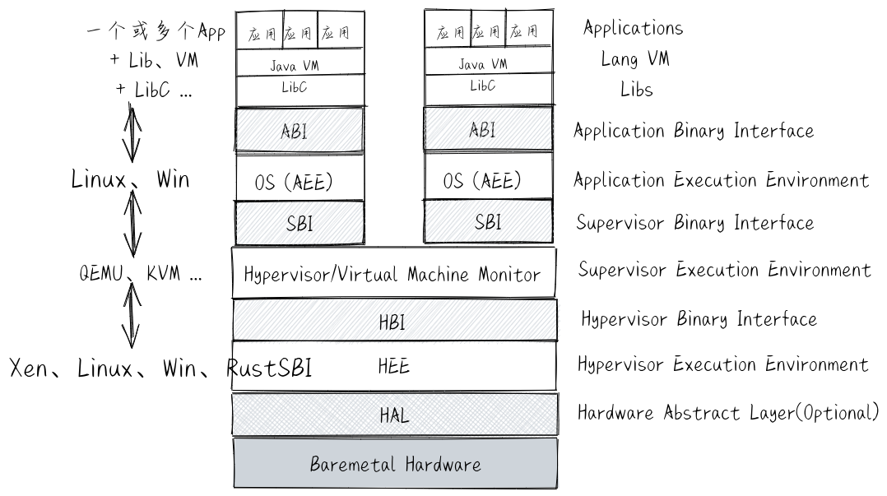
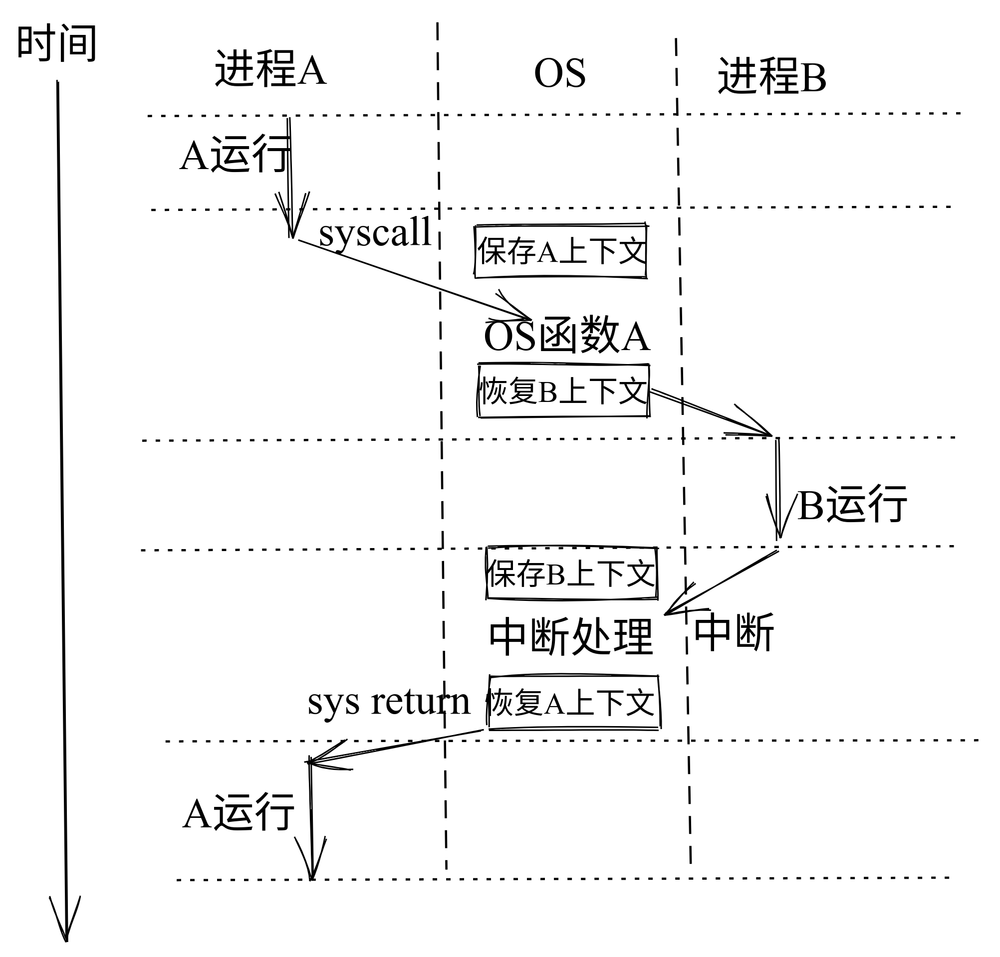
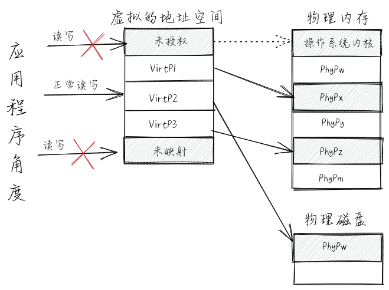
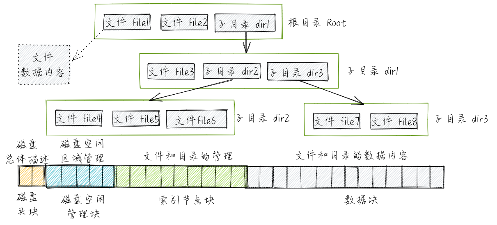

# rCore ch0

## 调用接口 Interface

### API 与 ABI 的区别

应用程序二进制接口 ABI 是不同二进制代码片段的连接纽带。ABI  定义了二进制机器代码级别的规则，主要包括基本数据类型、通用寄存器的使用、参数的传递规则、以及堆栈的使用等等。ABI  与处理器和内存地址等硬件架构相关，是用来约束链接器 (Linker) 和汇编器 (Assembler)  的。在同一处理器下，基于不同高级语言编写的应用程序、库和操作系统，如果遵循同样的 ABI 定义，那么它们就能正确链接和执行。

应用程序编程接口 API 是不同源代码片段的连接纽带。API 定义了一个源码级（如 C 语言）函数的参数，参数的类型，函数的返回值等。因此 API 是用来约束编译器 (Compiler) 的：一个 API 是给编译器的一些指令，它规定了源代码可以做以及不可以做哪些事。API  与编程语言相关，如 libc 是基于 C 语言编写的标准库，那么基于 C 的应用程序就可以通过编译器建立与 libc  的联系，并能在运行中正确访问 libc 中的函数。

### ABI Example (linux)

目前 Linux 有超过三百个的系统调用接口。下面列出了一些相对比较重要的操作系统接口或抽象，以及它们的大致功能：

- 进程（即程序运行过程）管理：复制创建进程 fork 、退出进程 exit 、执行进程 exec 等。
- 线程管理：线程（即程序的一个执行流）的创建、执行、调度切换等。
- 线程同步互斥的并发控制：互斥锁 mutex 、信号量 semaphore 、管程 monitor 、条件变量 condition variable 等。
- 进程间通信：管道 pipe 、信号 signal 、事件 event 等。
- 虚存管理：内存空间映射 mmap 、改变数据段地址空间大小 sbrk 、共享内存 shm 等。
- 文件I/O操作：对存储设备中的文件进行读 read 、写 write 、打开 open 、关闭 close 等操作。
- 外设I/O操作：外设包括键盘、显示器、串口、磁盘、时钟 … ，主要采用文件 I/O 操作接口。

## 抽象 Abstract

- 文件 (File) 是外设的一种抽象和虚拟化。特别对于存储外设而言，文件是持久存储的抽象。
- 地址空间 (Address Space) 是对内存的抽象和虚拟化。
- 进程 (Process) 是对计算机资源的抽象和虚拟化。而其中最核心的部分是对CPU的抽象与虚拟化。

## 执行环境 Execution Environment



我们可以给应用程序的执行环境一个基本的定义：**执行环境是应用程序正确运行所需的服务与管理环境，用来完成应用程序在运行时的数据与资源管理、应用程序的生存期等方面的处理，它定义了应用程序有权访问的其他数据或资源，并决定了应用程序的行为限制范围。**

## 控制流 Control Flow

### 普通控制流 CCF

程序运行时能以多种简单的控制流（顺序、分支、循环结构和多层嵌套函数调用）组合的方式，来一行一行的执行源代码（以编程语言级的视角），也是一条一条的执行汇编指令（以汇编语言级的视角）。对于上述的不同描述，我们可以统称其为 **普通控制流** (CCF，Common Control Flow，简称 控制流) 。在应用程序视角下，它只能接触到它所在的执行环境，不会跳到其他执行环境，所以应用程序执行基本上是以普通控制流的形式完成整个运行的过程。

### 异常控制流 ECF

 **异常控制流** 是处理器在执行过程中的突变，其主要作用是通过硬件和操作系统的协同工作来响应处理器状态中的特殊变化。比如当应用程序正在执行时，产生了时钟外设中断，导致操作系统打断当前应用程序的执行，转而进入 **操作系统** 执行环境去处理时钟外设中断。处理完毕后，再回到应用程序中被打断的地方继续执行。

### 控制流上下文 Context

这里我们把控制流在执行完某指令时的物理资源内容，即确保下一时刻能继续 *正确* 执行控制流指令的物理资源内容称为控制流的 **上下文** (Context) ，也可称为控制流所在执行环境的状态。

- 物理资源：即计算机硬件资源，如CPU的寄存器、可访问的物理内存等。
- 虚拟资源：即操作系统提供的资源，如文件，网络端口号，网络地址，信号等。

在操作系统中，需要处理三类异常控制流：外设中断 (Device Interrupt) 、陷入 (Trap) 和异常 (Exception，也称Fault Interrupt)。

## 进程 Process

### 进程上下文 Context

### 进程切换 Switch



## 地址空间 Address Space



## 文件 File



## 操作系统特征

基于操作系统的四个抽象，我们可以看出，从总体上看，操作系统具有五个方面的特征：虚拟化 (Virtualization)、并发性  (Concurrency)、异步性、共享性和持久性 (Persistency)。

- 虚拟化可以理解为它对内存、CPU  的抽象和处理；
- 并发性和共享性可以理解为操作系统支持多个应用程序“同时”运行；
- 异步性可以从操作系统调度、中断处理对应用程序执行造成的影响等几个方面来理解；
- 持久性则可以从操作系统中的文件系统支持把数据方便地从磁盘等存储介质上存入和取出来理解。

### 内存虚拟化 Memory Virtualization

实际上，编译器 (Compiler，比如 gcc) 和链接器 (linker，比如 ld)  也不知道程序每个符号对应的地址应该放在未来程序运行时的哪个物理内存地址中。所以，编译器的一个简单处理办法就是，设定一个固定地址（比如  0x10000）作为起始地址开始存放代码，代码之后是数据，所有变量和函数的符号都在这个起始地址之后的某个固定偏移位置。假定程序每次运行都是位于一个不会变化的起始地址。这里的变量指的是全局变量，其地址在编译链接后会确定不变。但局部变量是放在堆栈中的，会随着堆栈大小的动态变化而变化。这里编译器产生的地址就是虚拟地址。

这里，编译器和链接器图省事，找了一个适合它们的解决办法。当程序要运行的时候，这个符号所对应的虚拟内存地址到计算机的物理内存地址的映射必须要解决了，这自然就推到了操作系统身上。操作系统会把编译器和链接器生成的执行代码和数据放到空闲的物理内存中，并建立虚拟地址到物理地址的映射关系。由于物理内存中的空闲区域是动态变化的，这导致虚拟地址到物理地址的映射关系也是动态变化的，需要操作系统来维护好可变的映射关系，确保编译器“固定起始地址”的假设成立。只有操作系统维护好了这个映射关系，才能让程序员只需写一些易于人理解的字符串符号来代表一个内存空间地址。这样，编译器只需确定一个固定地址作为程序的起始地址，就可以不用考虑将来这个程序要在哪个物理地址空间运行的问题，从而实现了 **内存地址虚拟化** 。

应用程序在运行时不用考虑当前物理内存是否够用。如果应用程序需要一定空间的内存，但由于在某些情况下，物理内存的空闲空间可能不多了，这时操作系统通过把物理内存中最近没使用的空间（不是空闲的，只是最近用得少）换出（就是“挪地”）到硬盘上暂时缓存起来，这样空闲空间就大了，就可以满足应用程序的运行时内存需求了，从而实现了 **内存大小虚拟化** 。

### CPU 虚拟化 CPU Virtualization

再来看 CPU 虚拟化。不同的应用程序可以在内存中并发运行，相同的应用程序也可有多个拷贝在内存中并发运行。而每个程序都“认为”自己完全独占了 CPU 在运行，这是 **“CPU虚拟化”**，也是一种 **“时间虚拟化”**  。操作系统给了运行的应用程序一个幻象，即操作系统把时间分成小段，每个应用程序占用其中一小段时间片运行，用完这一时间片后，操作系统会切换到另外一个应用程序，让它运行。由于时间片很短，操作系统的切换开销也很小，应用程序或使用应用程序的用户基本上是看不出的，反而感觉到多个程序各自在独立“并行”执行，从而实现了 **CPU虚拟化** 。


## 平台与目标三元组

现代编译器工具集（以C编译器为例）的主要工作流程如下：

1. 源代码（source code） –> 预处理器（preprocessor） –> 宏展开的源代码
2. 宏展开的源代码 –> 编译器（compiler） –> 汇编程序
3. 汇编程序 –> 汇编器（assembler）–> 目标代码（object code）
4. 目标代码 –> 链接器（linker） –> 可执行文件（executables）

![[Pasted image 20221105100522.png]]

从上面给出的 [应用程序执行环境栈](http://rcore-os.cn/rCore-Tutorial-Book-v3/chapter1/1app-ee-platform.html#app-software-stack) 可以看出：

- 如果用户态基于的内核不同，会导致系统调用接口不同或者语义不一致；
- 如果底层硬件不同，对于硬件资源的访问方式会有差异。特别是如果 ISA 不同，则向软件提供的指令集和寄存器都不同。

我们可以通过 **目标三元组** (Target Triplet) 来描述一个目标平台。它一般包括 CPU 架构、CPU 厂商、操作系统和运行时库。

```
❯ rustc --version --verbose
rustc 1.65.0-nightly (1120c5e01 2022-09-08)
binary: rustc
commit-hash: 1120c5e01df508de64fe6642f22fadeb574afd6d
commit-date: 2022-09-08
host: x86_64-unknown-linux-gnu
release: 1.65.0-nightly
LLVM version: 15.0.0
```

我们选择的是 `riscv64gc-unknown-none-elf`，目标三元组中的 CPU 架构是 riscv64gc，厂商是 unknown，操作系统是 none，elf 表示没有标准的运行时库（表明没有任何系统调用的封装支持），但可以生成 ELF 格式的执行程序。

我们很清楚后续我们要开发的是一个操作系统内核，它必须直面底层物理硬件（bare-metal）来提供精简的操作系统服务功能，通用操作系统（如 Linux）提供的很多系统调用服务对这个内核而言是多余的。