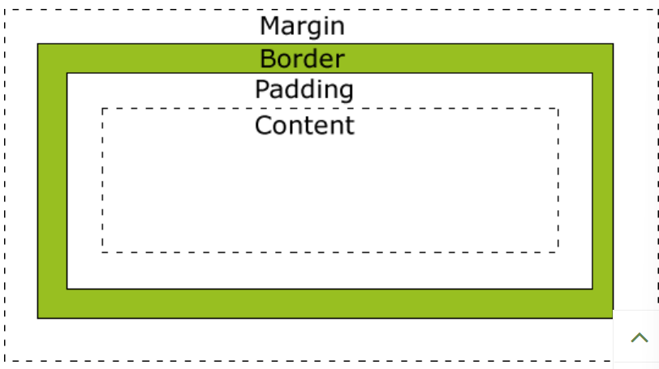
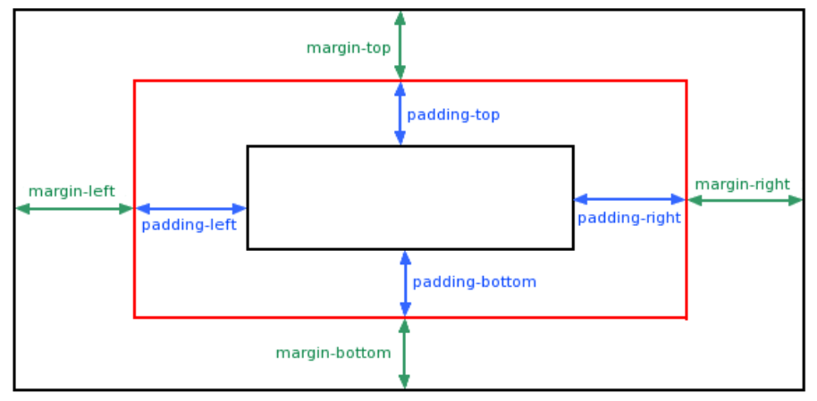
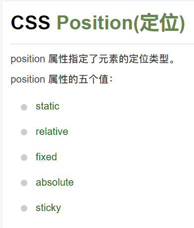
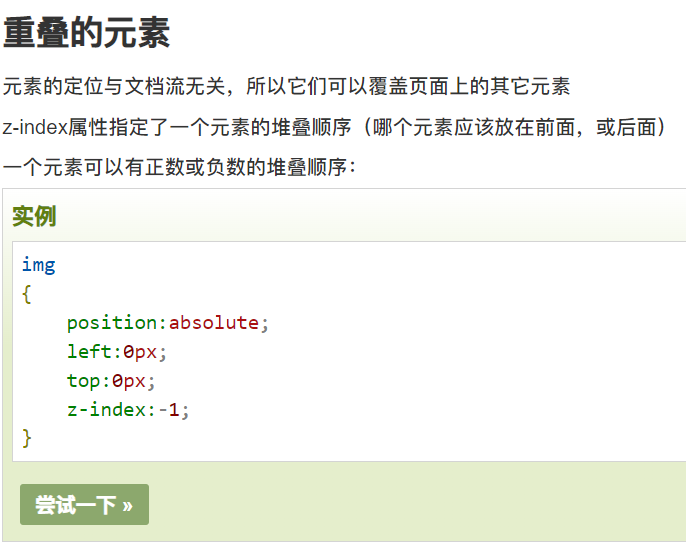

# css

Created: 2021-11-19 23:26:54 +0800

Modified: 2021-11-22 00:12:21 +0800

---

没啥好学的 现用现查

最重要的就是selector思想

class

.xxx{}

a:link active hover visited

table th td {border}

text-align

margin-left 边缘像素

font-size

font-family

color

background-color

盒子模型 box model

{width="6.758333333333334in" height="3.7916666666666665in"}

margin padding 透明

complete element:

div {

width:;

border:;

padding:;

margin:;

}

{width="7.616666666666666in" height="3.7416666666666667in"}

{width="10.433333333333334in" height="1.625in"}

{width="3.25in" height="3.816666666666667in"}

{width="5.708333333333333in" height="4.566666666666666in"}

伪元素 伪类

:first-line

:first-letter

:before

h1:before

{

content:"·";

}

!导航栏

