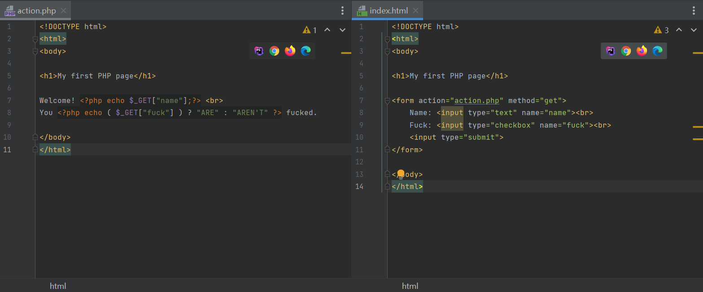

# PHP

## 基础

`.php`文件可以包含html和php代码，但是html不能执行php代码。

函数名/关键词不区分大小写，变量区分

注释：

```
// single line

/* */ inline comment

/*
... multi-line
*/
```

### 变量

`$name = "";`

```php
$txt = "W3Schools.com";
echo "I love " . $txt . "!";
echo "I love $txt!"
```

php区分局部和全局变量

全局变量储存在`$GLOBALS`数组（字典）内，函数内用索引引用可以更改全局变量：

```php
$x = 5;
$y = 10;

function myTest() {
  $GLOBALS['y'] = $GLOBALS['x'] + $GLOBALS['y'];
}

myTest();
echo $y; // outputs 15
```

static变量，函数内可保存的局部变量


### 类型

- String

    `""`

- Integer

- Float (floating point numbers - also called double)

- Boolean

- Array

    `$arr = array(a, b, c)`

    字典like:

    ```php
    $age = array("Peter"=>"35", "Ben"=>"37", "Joe"=>"43");
    $age['Peter'] = "35";
    $age['Ben'] = "37";
    $age['Joe'] = "43";
    
    // 循环
    foreach($age as $x => $x_value) {
      echo "Key=" . $x . ", Value=" . $x_value;
      echo "<br>";
    }
    ```

    排序函数：`sort()`

- Object

    语法类似Java：

    ```php
    class Car {
      public $color;
      public $model;
      public function __construct($color, $model) {
        $this->color = $color;
        $this->model = $model;
      } // 构建器函数
      public function message() {
        return "My car is a " . $this->color . " " . $this->model . "!";
      }
    }
    
    $myCar = new Car("black", "Volvo");
    echo $myCar -> message();
    echo "<br>";
    $myCar = new Car("red", "Toyota");
    echo $myCar -> message();
    ```

    

- NULL

- Resource

`var_dump($var)` 返回变量数据类型和值（`type(value)`）


`strlen()`, `str_word_count()`, `strrev()`

`strpos(string, text)`

`str_replace(string, text)`


`is_int()`

`is_float()`

`is_finite()`

`is_nan()`


`(int)$x` 类型转换


### 常量

`define(name, value, is_case_sensitive)`

value可以为数组

常量是全局的

### 运算符

`+ - * / % **`

`= += -= *= /= %=`

`++` `--`


比较运算符差不多，有些特别的：

`===` 严格相等（类型和值相等）

`!==` 不严格相等

`<=>` Spaceship 等于返回0，小于返回-1，大于返回1


`&& || !` `and or`

`xor`


字符串拼接：

`.` `$text1 . $text2`

`.=` `$text1 .= $text2`


`?:` `??`


### 判断语句

```php
if () {
	// code here...
} elseif {
    // code here...
} else {
    // code here...
}
```

```php
switch (n) {
  case label1:
    break;
  case label2:
    break;
  case label3:
    break;
    ...
  default:
}
```


### 循环

`while` `do while` `for` SAME

`foreach`:

```php
foreach ($array as $value) {
	// code here...
}

$colors = array("red", "green", "blue", "yellow");
foreach ($colors as $value) {
  echo "$value <br>";
}
```

### 函数

`function name() {}`

`declare(strict_types=1)`可以限制php在计算时变量类型需统一

参数默认值跟python一样

#### 返回值声明

`function name() : type {return $var}`

#### 引用变量

`function name(&$var)` 类似用指针修改变量


### 超全局变量

- $GLOBALS 全局变量

- $_SERVER 储存服务器信息，页面信息，Headers等

- $_REQUEST 储存请求信息

    ```php+html
    <form method="post" action="<?php echo $_SERVER['PHP_SELF'];?>">
      Name: <input type="text" name="fname">
      <input type="submit">
    </form>
    
    <?php
    if ($_SERVER["REQUEST_METHOD"] == "POST") {
      // collect value of input field
      $name = $_REQUEST['fname'];
      if (empty($name)) {
        echo "Name is empty";
      } else {
        echo $name;
      }
    }
    ?>
    
    ```

    

- $_POST 储存POST请求信息 来自HTTP POST请求

- $_GET 储存GET请求信息 来自URL末尾给出的参数

- $_FILES

- $_ENV

- $_COOKIE

- $_SESSION

## 表单

HTML `<form action="" method="">`标签负责收集表单内容；

php中的 `$_GET` 数组存有上传的表单内容；



php内的HTML表单：

`<form method="post" action="<?php echo htmlspecialchars($_SERVER["PHP_SELF"]);?>">`

